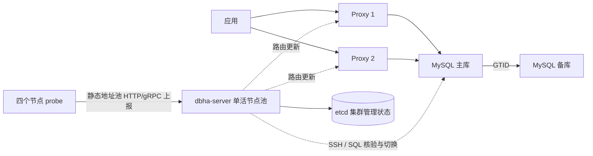

# DBHA

DBHA 是独立的 MySQL 主备高可用研究项目。新架构由 `dbha-server` 控制节点、etcd 和各 MySQL/Proxy 节点上的 `dbha-probe` 组成；生产拓扑推荐三个 server 单活运行并连接三成员 etcd。节点凭据和部署组由安装器自动创建；probe 上报数据库和 Proxy 实况，控制端核验后形成拓扑。管理数据保存在 etcd，业务 MySQL 仍保存业务数据。详细需求见 [自动元数据 PRD](docs/design/automatic-metadata-prd.md)。



需要 Go 1.26、Python 3。项目根目录的默认构建只产出 `bin/dbha-server` 和 `bin/dbha-probe`：

```bash
make build
make test
make check
```

单集群 Docker 实验见 [部署说明](deploy/dbha-v2/README.md)，生产推荐的七台 EC2 Docker/systemd 混合部署见 [EC2 手册](deploy/dbha-v2/ec2/README.md)。Compose 提供一个单集群 6 常驻容器实验和一个三集群 14 常驻容器实验。两者默认关闭自动切换；只有拓扑 READY 且完成核验后才显式启用。

旧 `admin/receiver/analysis/standalone-metadata` 源码和旧工具仍保留用于兼容及数据迁移，默认构建和新部署不启动它们。旧管理 MySQL 的离线导入见 [迁移说明](docs/design/migration.md)。新部署仍没有严格旧主 fencing、自动 rejoin 或零丢失承诺；单机 Compose 只用于实验，控制面高可用使用 EC2 手册中的三 controller 静态地址池方案。蓝鲸 Proxy 来自固定哈希的发布包，许可和来源见 [NOTICE.md](NOTICE.md)。
