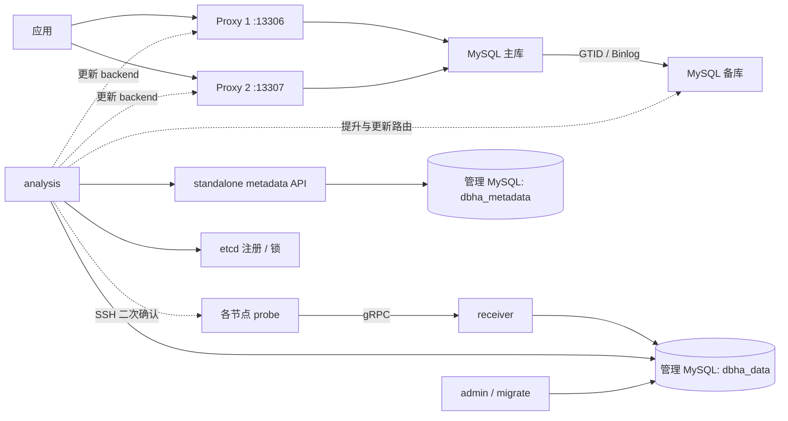

# DBHA v2 脱离 DBM 的 Docker 研究环境

EC2 原生编译、systemd 管理 DBHA 的五机部署，见 [EC2 从零安装手册](ec2/README.md)。

本目录已实现一个独立实验：复用仓库中的 DBHA v2，增加一个小型 MySQL 元数据 API，使用蓝鲸发布的 Proxy 二进制启动双 Proxy。无需启动 DBM Django、CMDB、GSE 或 Kafka。它用于研究和故障演练，单机 Compose 不提供宿主机故障容错。

## 架构与代码



`dbha_data` 和 `dbha_metadata` 位于同一个独立管理 MySQL 容器，与被切换的业务主备分离。

|部分|入口与职责|
|---|---|
|v2 原有 HA 服务|`dbm-services/common/dbha-v2/cmd/{admin,receiver,analysis,probe}`|
|探测与上报|`internal/probe/harvester/mysql`，probe 与 MySQL/Proxy 在同一容器，SSH 检查能反映节点容器故障|
|MySQL 切换|`internal/analysis/switcher/mysql/mysql_switch_instance.go`：备库检查、停止复制、提升、Proxy 路由修改、元数据更新|
|独立元数据 API|`dbm-services/common/dbha-v2/tools/cmd/standalone-metadata`：MySQL 持久化节点与角色，动态生成主备和 Proxy 关系|
|构建、配置、演练|本目录的 `Dockerfile`、`configure.py`、`compose.yaml`、`nodes/`、`smoke.py`|

元数据 API 保留 v2 调用的三个协议：查询 metadata、update-status、swap-mysql-role。角色交换是有方向的事务：同一次旧主→新主请求重试不会反向切换。seed 使用 `INSERT IGNORE`，复制 bootstrap 有持久化完成标记，重启不会重置拓扑。API 接受请求体 token 或 Bearer token；详情见 adapter 的 README。

## 启动和演练

需要 Docker Compose、Python 3，以及构建时访问镜像仓库、Go 模块与 GitHub 的网络。首次构建需下载依赖，容器统一使用 `linux/amd64`，ARM 主机依赖 Docker 的 x86 模拟能力。

从仓库根目录执行：

```bash
bash deploy/dbha-v2/lab.sh up
bash deploy/dbha-v2/lab.sh check
bash deploy/dbha-v2/lab.sh enable-switching
bash deploy/dbha-v2/lab.sh failover-test
bash deploy/dbha-v2/lab.sh disable-switching
```

`up` 生成配置并构建镜像，默认关闭自动切换。`failover-test` **只停止此实验的 mysql-master 容器**，然后验证自动提升、双 Proxy 路由、故障后写入、角色请求重放、Proxy 重启。

测试后旧主保持停止。不要直接执行全量 `docker compose up` 将其重新启动；`lab.sh up` 检测到已切换拓扑会拒绝启动旧主。此实验不自动恢复复制或清空卷。停止实验：

```bash
bash deploy/dbha-v2/lab.sh stop
```

Proxy 仅映射宿主机 `127.0.0.1:13306`、`127.0.0.1:13307`。业务客户端使用 `app` 用户与 `.env` 中的 `APP_PASSWORD`，数据库为 `lab`。秘密首次生成并保留在被 Git 忽略的 `.env` 和 `generated/`；保留这些文件才能复用已有数据卷。不要将生成后的配置或密码提交 Git。

### 三组集群实验

`multicluster.py` 单独生成三组主备与双 Proxy 拓扑，不修改单集群的 `compose.yaml` 和 `generated/`。三组共用 `bk_biz_id=1`，`cluster_id` 为 `101/102/103`，域名为 `research-mysql-1.local` 至 `research-mysql-3.local`。它使用独立网络 `10.203.81.0/24`，六个 Proxy 映射到宿主机 `14306` 至 `14311`。

生成配置及独立凭据，并验证 Compose 文件：

```bash
cd deploy/dbha-v2
python3 multicluster.py
docker compose --env-file generated-multi/.env -f generated-multi/compose.json config --quiet
```

首次运行先构建三类共用镜像；已有当前源码构建的同名镜像时可以直接启动：

```bash
docker build --platform linux/amd64 -f Dockerfile -t dbha-v2-lab-runtime:local ../..
docker build --platform linux/amd64 -f nodes/Dockerfile.mysql -t dbha-v2-lab-mysql:local nodes
docker build --platform linux/amd64 -f nodes/Dockerfile.proxy -t dbha-v2-lab-proxy:local nodes
docker compose --env-file generated-multi/.env -f generated-multi/compose.json up -d
python3 smoke_multi.py
```

默认关闭自动切换。启用后可运行多集群故障演练：

```bash
python3 multicluster.py --enable-switching
docker compose --env-file generated-multi/.env -f generated-multi/compose.json up -d --no-deps --force-recreate analysis
python3 smoke_multi.py --failover
```

演练依次检查第一组单独故障、第二和第三组同时故障、六个 Proxy 重启后仍连接各自的新主，以及各组应用写入不串库。脚本会在计划重启 Proxy 前关闭自动切换。也可手动关闭并复查：

```bash
python3 multicluster.py
docker compose --env-file generated-multi/.env -f generated-multi/compose.json up -d --no-deps --force-recreate analysis
python3 smoke_multi.py
```

故障演练会停止原主，测试后不能执行全量 `up`。恢复前只操作明确的服务，避免旧主未经数据校验就重新加入。停止实验可保留数据；`down -v` 则删除三集群实验的管理库、etcd、六个业务 MySQL 和复制初始化数据：

```bash
docker compose --env-file generated-multi/.env -f generated-multi/compose.json stop
docker compose --env-file generated-multi/.env -f generated-multi/compose.json down -v
```

生成的配置与凭据仍保留在被 Git 忽略的 `generated-multi/`。

以下是来源工作区在 2026-09-09 的三组 Docker 历史验证记录；不代表本独立仓库的新检出已运行：

- 12 条实例元数据及其主备、Proxy 关联按集群隔离；跨集群角色交换请求返回 HTTP 409，角色不变。
- 三组 GTID 主从复制、12 节点近期指标、六个 Proxy 路由及应用写入隔离通过。
- 第一组停止 `.21` 后自动切到 `.22`；第二、三组的主库和路由保持不变。
- 同时停止第二组 `.41` 与第三组 `.61` 后，分别自动切到 `.42`、`.62`，新主复制配置清除，应用读写通过。
- 六个 Proxy 全部重启后仍指向各自新主，没有回连旧主或串集群。

历史演练首轮在自动切换开启时批量重启 Proxy，三个 Proxy 因短暂 SSH 不可达被标记为 `unavailable`，恢复进程后状态没有自动恢复。当时确认其路由、probe 进程和近期指标均正常后，通过元数据 API 恢复为 `running`。测试脚本已改为计划重启前关闭自动切换，并增加六个 Proxy 元数据状态的最终断言。关闭自动切换后再次重启全部六个 Proxy，路由、读写、近期指标与六个 `running` 状态复查通过。

以上是同一 Docker 主机、同一业务、单 Analysis 的历史功能验证，不是控制面冗余、旧主恢复或网络分区隔离测试。新检出的实际拓扑应以本机运行结果为准。

原单组实验的容器静态网络为 `10.203.80.0/24`：管理库 `.10`、etcd `.11`、metadata-api `.12`、admin `.13`、receiver `.14`、analysis `.15`、业务主备 `.21/.22`、双 Proxy `.31/.32`。如果与本机网络冲突，需同时调整 Compose、配置生成器和 seed，不能只改一处。

## 运行条件

- Docker 构建包含仓库内的 `go-pubpkg`，通过构建时 `go.work` 引用；宿主机不需要安装 Go 或 protoc。直接从源码构建则需要 Go 1.26，仓库根目录已有 `go.work`。
- admin 的 `migrate --type all` 创建 `dbha_data` 和默认 SSH 二次确认策略。元数据库初始化不能代替这一步。
- 管理库 SQL mode 允许零日期，因为当前 v2 元数据缓存写入零值 `deleted_at`。这一兼容设置只配置在管理库。
- probe 直接向 receiver 发送 gRPC，`admin.syncInterval=0s` 禁用周期配置同步，保留静态 endpoint 与凭据。服务端口与 Proxy admin 端口使用不同采集凭据。
- 容器入口生成 machine-id，启动 SSH 与 probe，并监督进程。Proxy 二进制使用自己的 daemon/PID 文件，入口监测实际 PID；日志位于容器 `/var/log/dbha/`。
- Proxy 每次启动先查询元数据中的唯一可用主库，避免故障切换后重启又连旧主。实验白名单包含 `app@%`、`dbha@%`、`root@%`；生产环境需要收紧。
- 原有 `probe health -c` 存在配置路径未传给子命令的问题，本次包含最小修复和回归测试。

## Proxy 来源

镜像下载并校验蓝鲸的 [mysql-proxy-0.82.15.tar.gz](https://github.com/TencentBlueKing/blueking-dbm/releases/download/v1.0.0/mysql-proxy-0.82.15.tar.gz)，内部版本为 `mysql-proxy 0.8.2.15`。

SHA256：`f94a7a7168597d4e453ced832e413379d48a45ca2027e87c841b6b4f5bf7227a`。

发布包包含二进制、动态库和 admin Lua；本次没有获得对应定制版本的完整 C 源码。DBHA v2 与独立适配器可以源码构建，Proxy 此处是二进制部署。不能用普通上游 Proxy 替换后就假定它支持蓝鲸的 `refresh_backends`、`refresh_users` 等扩展。

## 安全与功能边界

- 当前策略以指标缺失和 SSH 二次确认失败触发主机切换。只停止 mysqld、但 SSH 仍可连接，与停止整个节点容器不是同一种故障。
- 未增加旧主 fencing、STONITH 或自动 rejoin。etcd 锁只协调切换执行者，不能防止网络分区后的双主写入。
- v2 不显式执行新主 `read_only=OFF`。因此实验备用节点默认可写，业务端口不映射宿主机；应用通过 Proxy 写入。生产部署必须单独设计只读控制与隔离。
- 实验跳过 checksum 检查。复制延迟阈值为 30 秒，但当前上游检查对 `Seconds_Behind_Master=NULL` 放行；这不是零丢失承诺，也没有在这里补充半同步复制保障。
- 本实验 `bind_entry` 为空，未实现主/从 DNS、VIP、CLB、Polaris 或 tbinlogdumper 切换。不支持的 API 会失败，不会假装成功。应用使用双 Proxy 显式端点，若要统一域名需另加入口故障处理。
- 蓝鲸监控告警未接入，日志中的告警上报失败不表示切换失败。管理 MySQL、etcd 和各控制服务当前均是单实例。
- 跨物理服务器部署需要可互通的真实地址/跨主机网络，分别部署管理面和数据节点，并补充管理面冗余、隔离与恢复演练。一个宿主机上的两个 MySQL 容器不能抵抗该宿主机宕机。

## 验证记录

以下是来源工作区在 2026-09-09 的单组 Docker 历史验证记录；不代表本独立仓库的新检出已运行：

- 四个 v2 二进制、metadata adapter、MySQL 节点与 Proxy 镜像构建成功。
- 主备 GTID 复制、四节点实时采集、双 Proxy 访问和复制读写通过。
- 停止 `.21` 后，v2 将 `.22` 提升为主；`.21` 元数据变为 `backend_slave/unavailable`。
- 双 Proxy 均返回 `@@server_id=22`，故障后写入成功；重复角色交换未反切，Proxy 1 重启后仍指向 `.22`。
- 使用普通 `app` 用户经 Proxy 写入成功；新主复制配置已被清除。
- metadata adapter 单元测试、真实 MySQL 事务/幂等测试及 `go vet` 通过。
- `TestHealthCmdUsesRootConfigFlag` 回归测试通过。
- 修复后的 `probe health -j -c` 在实际节点返回 `running`；节点镜像重新创建后，已有主库角色与 Proxy 路由保持，应用读写再次通过。
- 配置生成、凭据保留、文件权限、切换开关、Compose 配置与 shell 语法验证通过。

查看元数据和切换日志：

```bash
cd deploy/dbha-v2
docker compose exec metadata-store sh -c 'MYSQL_PWD="$MYSQL_ROOT_PASSWORD" mysql -uroot dbha_metadata'
# SQL: SELECT ip,port,instance_role,status FROM standalone_instances;
# SQL: SELECT content FROM dbha_data.t_db_switching_log ORDER BY id DESC LIMIT 20;
docker compose exec analysis tail -50 /var/log/dbha/analysis.log
```
