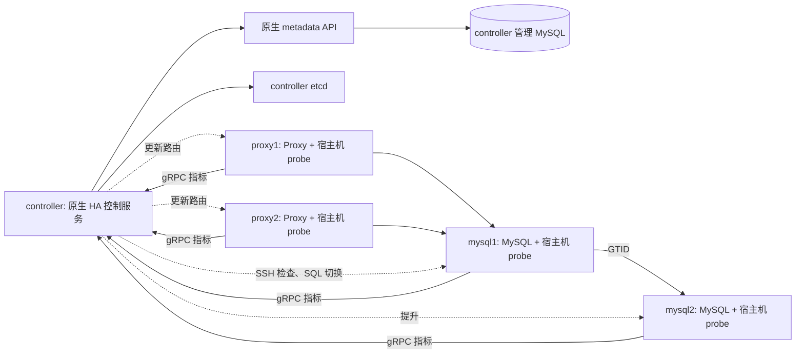

# EC2 从零部署 DBHA v2：源码编译 + systemd

本手册对应 [DBHA 独立项目](https://github.com/liuflylove666/DBHA)中的 DBHA v2 和 standalone metadata 适配器。目标是五台 EC2 的研究环境，实际执行命令前请把示例 IP 替换成你创建的 EC2 私网 IP。

本手册采用以下安装方式：

- `dbha-admin`、`dbha-receiver`、`dbha-analysis`、`dbha-probe`、`standalone-metadata` 在 EC2 用 Go 从源码编译，安装到 `/opt/dbha/bin`，由原生 systemd 管理。
- MySQL 和 etcd 使用官方项目镜像，systemd 管理对应的 `docker run` 进程。
- 蓝鲸定制 Proxy 没有已取得的完整源码或已确认的官方镜像；本目录把蓝鲸官方 release 包封装成自己的镜像。**这个 Proxy 镜像不是蓝鲸官方镜像，也不是源码编译产物。**如果要求 Proxy 也只使用官方镜像，本方案在此处缺少已确认的交付物，不能拿普通上游 Proxy 直接替换。
- probe 与 SSH 都在 EC2 宿主机。此前 `nodes/` 的“数据库 + probe + SSH 同容器”镜像不用于本手册。

本手册尚未在五台真实 EC2 上完成部署和故障演练。下文的 Docker HA、辅助配置、systemd 静态检查和 Proxy 容器结果是来源工作区的历史验证记录；五台真实 EC2 的网络、权限、故障切换需要按以下步骤验收。

## 0. 先认识机器和网络

| 名称 | 示例私网 IP | 可用区 | 运行内容 | 研究环境资源估算 |
|---|---|---|---|---|
| controller | 10.80.10.10 | AZ-A | 管理 MySQL、etcd、metadata、admin、receiver、analysis；源码编译 | x86_64，4 vCPU / 16 GiB |
| mysql1 | 10.80.10.21 | AZ-A | 业务 MySQL 初始主库、原生 probe、SSH | x86_64，2–4 vCPU / 8–16 GiB |
| mysql2 | 10.80.20.22 | AZ-B | 业务 MySQL 初始备库、原生 probe、SSH | 同 mysql1 |
| proxy1 | 10.80.10.31 | AZ-A | Proxy 容器、原生 probe、SSH | x86_64，2 vCPU / 4 GiB |
| proxy2 | 10.80.20.32 | AZ-B | Proxy 容器、原生 probe、SSH | 同 proxy1 |

这些是实验资源估算，不是容量压测结果或价格承诺。统一选 **Ubuntu Server 24.04 LTS amd64**，不要选 Graviton/arm64，以匹配已验证的 Proxy 发布包。

本手册只有业务节点跨 AZ，controller 仍是单点。因此它演示数据库主机故障切换，不保证管理面或整区故障下持续可用。[AWS 子网与可用区说明](https://docs.aws.amazon.com/vpc/latest/userguide/configure-subnets.html)。



## 1. 在 AWS 控制台创建基础资源

以下选用“有公网出口、只开放管理 SSH”的简单研究网络。生产环境可使用私有子网、NAT 与堡垒机/SSM，但不要在未验证 SSH 二次确认前启用切换。

1. 选择一个 AWS Region，全套资源在同一 Region。
2. 创建 VPC，IPv4 CIDR：`10.80.0.0/16`，开启 DNS resolution 和 DNS hostnames。
3. 创建两条子网：AZ-A 为 `10.80.10.0/24`，AZ-B 为 `10.80.20.0/24`。
4. 创建并附加 Internet Gateway。两条子网关联的路由表保留 VPC local 路由，并增加 `0.0.0.0/0 -> Internet Gateway`。
5. 创建 EC2 密钥对，下载 PEM，保存在管理电脑，权限设置为 `chmod 600`。不要把 PEM 放进源码包、数据库目录或提交 Git。
6. 按表创建五台 Ubuntu amd64 EC2，手动指定私网 IP，研究阶段分配公网 IPv4，以便你的电脑 SSH 和服务器下载依赖。服务配置始终使用**私网 IP**，不填公网 IP。[EC2 地址说明](https://docs.aws.amazon.com/AWSEC2/latest/UserGuide/using-instance-addressing.html)。
7. controller 的系统盘建议至少 60 GiB；MySQL/controller 各增加一块空的加密 gp3 数据盘，例如研究用 100 GiB。实际容量按数据量调整。
8. 使用默认研究网络 ACL；如果自定义了 ACL，必须放行相应流量与返回临时端口。

### 1.1 安全组

创建 `sg-dbha-control`、`sg-dbha-mysql`、`sg-dbha-proxy`。下面是**入站**规则；研究阶段出站允许访问互联网下载源和 VPC 内目标。安全组来源选择另一个安全组时填真实 SG ID。

| 目标安全组 | TCP 端口 | 允许来源 | 用途 |
|---|---:|---|---|
| 三组 | 22 | 你的管理电脑公网 IP/32 | ubuntu 密钥登录 |
| sg-dbha-mysql、sg-dbha-proxy | 22 | sg-dbha-control | v2 对宿主机做 SSH 二次确认 |
| sg-dbha-control | 50051、50052 | sg-dbha-mysql、sg-dbha-proxy | probe 到 admin / receiver |
| sg-dbha-control | 8080 | sg-dbha-proxy | Proxy 启动查询元数据 |
| sg-dbha-control | 3306、2379 | sg-dbha-control | 管理库、etcd，仅控制面 |
| sg-dbha-mysql | 3306 | sg-dbha-control | 检测、切换、管理 |
| sg-dbha-mysql | 3306 | sg-dbha-mysql | MySQL 主从复制 |
| sg-dbha-mysql | 3306 | sg-dbha-proxy | Proxy 到业务 MySQL |
| sg-dbha-proxy | 10000 | sg-dbha-control、应用服务器 SG | 数据端口 |
| sg-dbha-proxy | 11000 | sg-dbha-control | Proxy admin 控制端口 |

50060 与 50080–50082 暂不对外开放，通过 controller 的本机检查或 SSH 隧道使用。单成员 etcd 的 2380 不需要对其他 EC2 放行。不要开放数据库、Proxy admin、etcd 到 `0.0.0.0/0`。

安全组是有状态规则；同时关联多个安全组时，要检查其他组是否额外放宽了入站权限。[AWS 安全组说明](https://docs.aws.amazon.com/AWSEC2/latest/UserGuide/ec2-security-groups.html)。

## 2. 所有机器：初始化系统和目录

从管理电脑分别登录五台机器，下面 `<PUBLIC_IP>` 必须替换：

```bash
ssh -i /path/to/dbha-ec2.pem ubuntu@<PUBLIC_IP>
```

**五台 EC2 都执行：**

```bash
sudo apt-get update
sudo apt-get install -y ca-certificates curl gnupg git python3 jq openssh-server
uname -m
# 应为 x86_64

getent passwd dbha || sudo useradd --system --create-home \
  --home-dir /var/lib/dbha --shell /bin/bash dbha
sudo install -d -o root -g dbha -m 0750 /etc/dbha
sudo install -d -o root -g root -m 0755 /opt/dbha/bin
sudo install -d -o dbha -g dbha -m 0750 /var/log/dbha
sudo systemctl enable --now ssh
cat /etc/machine-id
```

各机器 `/etc/machine-id` 应存在且不同。probe 需要它；不要把另一台 EC2 的 `/etc/machine-id` 复制过来。

### 2.1 controller、mysql1、mysql2：挂载空数据盘

先识别你刚挂上的 **空 EBS 数据卷**，不要假设设备名固定：

```bash
lsblk -o NAME,SIZE,TYPE,FSTYPE,MOUNTPOINTS,SERIAL
sudo blkid
```

将下面变量改成核实后的空盘路径。示例 `/dev/nvme1n1` **不是让你直接照抄格式化的目标**：

```bash
DATA_DEVICE=/dev/nvme1n1
sudo file -s "$DATA_DEVICE"
lsblk -f "$DATA_DEVICE"
```

只有确认是新建空数据盘、没有需要保留的分区/文件系统后才执行：

```bash
sudo mkfs.ext4 "$DATA_DEVICE"
sudo mkdir -p /srv/dbha
sudo mount "$DATA_DEVICE" /srv/dbha
sudo blkid -s UUID -o value "$DATA_DEVICE"
```

将返回 UUID 写入 `/etc/fstab`，例如：

```text
UUID=<实际UUID> /srv/dbha ext4 defaults,nodev,nosuid 0 2
```

然后验证：

```bash
sudo mount -a
findmnt /srv/dbha
sudo mkdir -p /srv/dbha/mysql
```

controller 另外执行：

```bash
sudo mkdir -p /srv/dbha/etcd
```

卷来自快照且已有文件系统时应直接挂载，不能重新 `mkfs`。EBS 设备名可能变化，fstab 使用 UUID；详见 [AWS EBS 挂载说明](https://docs.aws.amazon.com/ebs/latest/userguide/ebs-using-volumes.html)。

## 3. 五台机器：安装 Docker Engine

这里 Docker 只运行 MySQL、etcd、Proxy；DBHA/metadata 不在 Docker 中运行。以下以全新 Ubuntu 24.04 为前提，使用 Docker 官方 APT 源：

```bash
sudo install -d -m 0755 /etc/apt/keyrings
curl -fsSL https://download.docker.com/linux/ubuntu/gpg \
  | sudo gpg --dearmor -o /etc/apt/keyrings/docker.gpg
sudo chmod 0644 /etc/apt/keyrings/docker.gpg
printf 'deb [arch=amd64 signed-by=/etc/apt/keyrings/docker.gpg] https://download.docker.com/linux/ubuntu noble stable\n' \
  | sudo tee /etc/apt/sources.list.d/docker.list >/dev/null
sudo apt-get update
sudo apt-get install -y docker-ce docker-ce-cli containerd.io docker-buildx-plugin docker-compose-plugin
sudo systemctl enable --now docker
sudo docker version
```

如果已有 Docker 源或发行版 Docker 包，先依据 [Docker Ubuntu 安装文档](https://docs.docker.com/engine/install/ubuntu/) 处理冲突，不重复创建不同签名配置。本手册使用 `sudo docker`，无需将用户加入 Docker 管理组。

controller、mysql1、mysql2 拉取 MySQL：

```bash
sudo docker pull --platform linux/amd64 mysql:8.0-debian
```

controller 拉取 etcd，并安装命令行 MySQL 客户端：

```bash
sudo docker pull gcr.io/etcd-development/etcd:v3.6.0
sudo apt-get install -y mysql-client
```

记录镜像实际摘要：

```bash
sudo docker image inspect mysql:8.0-debian --format '{{json .RepoDigests}}'
```

同一轮实验三个 MySQL 应使用相同摘要。`8.0-debian` 是为了复现已经验证的蓝鲸兼容链路；MySQL 8.0 已到生命周期末期，本手册不是新的生产版本选型建议。换 8.4/更新版本需要重新验证认证插件、复制命令和 Proxy 兼容性。[MySQL 官方版本说明](https://dev.mysql.com/doc/relnotes/mysql/8.0/en/)。

## 4. 获取本项目源码

在 controller、mysql1、mysql2、proxy1、proxy2 五台 EC2 分别执行。使用本独立仓库的同一个版本；记录检出的提交号，便于核对各机器的配置脚本与 systemd 单元。

```bash
git clone https://github.com/liuflylove666/DBHA.git "$HOME/dbha-source"
cd "$HOME/dbha-source"
git rev-parse HEAD
```

仓库包含 standalone metadata API、EC2 配置脚本和 probe health 修复。运行 `configure.py` 后生成的 `generated/`、`generated-multi/` 和 `.env` 含环境凭据，必须留在对应机器的受限目录，不能提交到 Git。

## 5. controller：安装 Go，在 EC2 原生编译

本模块 `go.mod` 要求 Go 1.26.0。以下固定使用该版本工具链；工具链和操作系统依赖允许使用官方包，应用服务本身从源码构建。

```bash
cd /tmp
curl -fLO https://go.dev/dl/go1.26.0.linux-amd64.tar.gz
printf '%s  %s\n' \
  aac1b08a0fb0c4e0a7c1555beb7b59180b05dfc5a3d62e40e9de90cd42f88235 \
  go1.26.0.linux-amd64.tar.gz | sha256sum -c -
sudo mkdir -p /opt/go1.26.0
sudo tar -xzf go1.26.0.linux-amd64.tar.gz -C /opt/go1.26.0 --strip-components=1
export PATH=/opt/go1.26.0/bin:$PATH
go version
```

工具链下载及摘要来源：[Go 官方下载索引](https://go.dev/dl/?mode=json&include=all)。若该安装目录已被使用，不要混入不同版本文件。

建立只供这次编译使用的 workspace：

```bash
DBHA_SOURCE="$HOME/dbha-source"
mkdir -p /tmp/dbha-native-build/out
cd /tmp/dbha-native-build
go work init "$DBHA_SOURCE/dbm-services/common/dbha-v2" \
  "$DBHA_SOURCE/dbm-services/common/go-pubpkg"
export GOWORK=/tmp/dbha-native-build/go.work
export GOTOOLCHAIN=local
cd "$DBHA_SOURCE/dbm-services/common/dbha-v2"
go mod download
```

`go.work` 已存在时跳过 `go work init`，先核实其中路径仍正确。接着逐个编译：

```bash
CGO_ENABLED=0 go build -trimpath -o /tmp/dbha-native-build/out/dbha-admin ./cmd/admin
CGO_ENABLED=0 go build -trimpath -o /tmp/dbha-native-build/out/dbha-receiver ./cmd/receiver
CGO_ENABLED=0 go build -trimpath -o /tmp/dbha-native-build/out/dbha-analysis ./cmd/analysis
CGO_ENABLED=0 go build -trimpath -o /tmp/dbha-native-build/out/dbha-probe ./cmd/probe
CGO_ENABLED=0 go build -trimpath -o /tmp/dbha-native-build/out/standalone-metadata ./tools/cmd/standalone-metadata

go test -count=1 ./tools/cmd/standalone-metadata
go test -count=1 -run TestHealthCmdUsesRootConfigFlag ./internal/probe
sha256sum /tmp/dbha-native-build/out/*
```

元数据包内依赖真实 MySQL 的测试在没配置测试 DSN 时可能跳过；不能把它的跳过视为真实数据库验收。后面的初始化和切换验证才覆盖实际环境。

安装 controller 的四个进程：

```bash
sudo install -m 0755 /tmp/dbha-native-build/out/dbha-admin /opt/dbha/bin/
sudo install -m 0755 /tmp/dbha-native-build/out/dbha-receiver /opt/dbha/bin/
sudo install -m 0755 /tmp/dbha-native-build/out/dbha-analysis /opt/dbha/bin/
sudo install -m 0755 /tmp/dbha-native-build/out/standalone-metadata /opt/dbha/bin/
```

四台数据/Proxy EC2 只需要安装这次编译出的 `dbha-probe`。可以通过管理电脑中转，避免把 PEM 放进 controller：

```bash
# 管理电脑执行，先从 controller 下载你的编译产物
scp -i /path/to/dbha-ec2.pem ubuntu@<CONTROLLER_PUBLIC_IP>:/tmp/dbha-native-build/out/dbha-probe /tmp/dbha-probe
# 对 mysql1、mysql2、proxy1、proxy2 分别上传
scp -i /path/to/dbha-ec2.pem /tmp/dbha-probe ubuntu@<NODE_PUBLIC_IP>:/tmp/dbha-probe
```

**四台节点：**

```bash
sudo install -m 0755 /tmp/dbha-probe /opt/dbha/bin/dbha-probe
sha256sum /opt/dbha/bin/dbha-probe
```

摘要应与 controller 编译产物一致。这里分发的是你刚从源码编译的程序，不依赖 DBHA release 预编译包。

## 6. controller：生成实际私网配置

```bash
cd "$HOME/dbha-source/deploy/dbha-v2/ec2"
cp inventory.example.json inventory.json
nano inventory.json
```

填入五台 EC2 的真实私网 IP，不是公网 IP。例如：

```json
{
  "controller": "10.80.10.10",
  "mysql1": "10.80.10.21",
  "mysql2": "10.80.20.22",
  "proxy1": "10.80.10.31",
  "proxy2": "10.80.20.32"
}
```

生成并测试：

```bash
python3 configure.py --inventory inventory.json
python3 test_configure.py
ls generated
```

输出包含 `controller/`、`mysql1/`、`mysql2/`、`proxy1/`、`proxy2/`、`inventory.json`、`secrets.env`。默认切换关闭。

`secrets.env` 是主凭据文件，保存好且只留给管理员。重新运行生成器会保留凭据；检测到同一输出目录的 IP 清单变化会拒绝，避免意外改写已有拓扑。更换 IP 需要先做迁移，而不是删除清单绕过保护。

关键端口/配置已自动写好：

| 文件 | 关键内容 |
|---|---|
| controller/admin.yaml | admin gRPC 50051、管理库、etcd |
| controller/receiver.yaml | gRPC 50052、管理库写入 |
| controller/analysis.yaml | metadata API、SSH 用户 dbha、切换策略、SQL 凭据 |
| controller/metadata.env | 8080 API、MySQL DSN、token |
| controller/mysql-init/ | 元数据 schema、实际 IP seed、dbha_store 账户 |
| 节点/probe.yaml | 本机私网 IP、采集凭据、controller 50051/50052 |
| mysql1、mysql2/mysql-init/ | dbha、repl、app 账户 |
| proxy1、proxy2/proxy.env | Proxy admin 凭据、元数据 API |
| 节点/ssh-password | DBHA SSH 检测账户密码 |

## 7. 分发并安装配置

controller 配置直接从本机 generated 安装。其他四台配置通过管理电脑中转，每次只传该主机目录：

```bash
# 管理电脑示例：mysql1；对另三台改目录和目标 IP
scp -r -i /path/to/dbha-ec2.pem \
  ubuntu@<CONTROLLER_PUBLIC_IP>:/home/ubuntu/dbha-source/deploy/dbha-v2/ec2/generated/mysql1 \
  /tmp/dbha-config-mysql1
scp -r -i /path/to/dbha-ec2.pem /tmp/dbha-config-mysql1 ubuntu@<MYSQL1_PUBLIC_IP>:/tmp/
```

**controller：**

```bash
cd "$HOME/dbha-source/deploy/dbha-v2/ec2"
sudo install -o root -g dbha -m 0640 generated/controller/*.yaml /etc/dbha/
sudo install -o root -g root -m 0600 generated/controller/*.env /etc/dbha/
sudo install -o root -g root -m 0600 generated/controller/*-client.cnf /etc/dbha/
sudo install -o root -g root -m 0600 generated/controller/bootstrap-replication.sql /etc/dbha/
sudo install -m 0644 generated/controller/mysql.cnf /etc/dbha/mysql.cnf
sudo install -d -m 0755 /etc/dbha/mysql-init
sudo install -m 0644 generated/controller/mysql-init/*.sql /etc/dbha/mysql-init/
```

**mysql1/mysql2，修改 `HOST_CONFIG` 为该机实际目录：**

```bash
HOST_CONFIG=/tmp/dbha-config-mysql1
sudo install -o root -g dbha -m 0640 "$HOST_CONFIG/probe.yaml" /etc/dbha/probe.yaml
sudo install -m 0600 "$HOST_CONFIG/mysql.env" /etc/dbha/mysql.env
sudo install -m 0600 "$HOST_CONFIG/ssh-password" /etc/dbha/ssh-password
sudo install -m 0644 "$HOST_CONFIG/mysql.cnf" /etc/dbha/mysql.cnf
sudo install -d -m 0755 /etc/dbha/mysql-init
sudo install -m 0644 "$HOST_CONFIG"/mysql-init/*.sql /etc/dbha/mysql-init/
```

**proxy1/proxy2，同样修改目录：**

```bash
HOST_CONFIG=/tmp/dbha-config-proxy1
sudo install -o root -g dbha -m 0640 "$HOST_CONFIG/probe.yaml" /etc/dbha/probe.yaml
sudo install -m 0600 "$HOST_CONFIG/proxy.env" /etc/dbha/proxy.env
sudo install -m 0600 "$HOST_CONFIG/ssh-password" /etc/dbha/ssh-password
sudo install -d -m 0750 /var/log/mysql-proxy
```

`mysql-init` 内 SQL 设为 0644，是因为官方 MySQL entrypoint 以容器 mysql 用户读取；宿主机上父目录 `/etc/dbha` 保持 root:dbha 0750，不向普通用户开放。这些 SQL 含初始化密码，不能搬到公共目录。元数据服务的 EnvironmentFile 由 systemd 读取，保持 root:root 0600。

配置安装并核对成功后，删除管理电脑和节点上本次中转的 `/tmp/dbha-config-<节点>` 目录，避免留下多份明文密码。保留 controller 的受限 `generated/` 目录及其凭据备份；不要把它放进源码包。

## 8. 四台节点：配置 DBHA 专用 SSH 用户

这里 DBHA 的检测账户是 `dbha`，你的 EC2 管理登录仍是 `ubuntu` + PEM。当前 v2 SSH detector 使用密码/交互式认证，没有把 EC2 PEM 私钥接入 detector 配置。

**mysql1、mysql2、proxy1、proxy2：**

```bash
sudo sh -c 'printf "dbha:%s\n" "$(cat /etc/dbha/ssh-password)" | chpasswd'
sudo tee /etc/ssh/sshd_config.d/60-dbha.conf >/dev/null <<'SSHCONF'
Match User dbha
    PasswordAuthentication yes
    KbdInteractiveAuthentication no
    AllowTcpForwarding no
    X11Forwarding no
    PermitTunnel no
Match all
SSHCONF
sudo /usr/sbin/sshd -t
sudo systemctl reload ssh
```

确认有效设置，addr 换成 controller 私网 IP：

```bash
sudo /usr/sbin/sshd -T -C user=dbha,host=controller,addr=10.80.10.10 \
  | grep -E 'passwordauthentication|kbdinteractiveauthentication'
```

必须看到 `passwordauthentication yes`。如果你在 AMI 中另设了 `AllowUsers`、`DenyUsers`、PAM 或账户过期策略，也要允许 `dbha`。本方案不授予该账户 sudo 权限。

**先不要启用自动切换。**密码或 SG 配错导致 SSH 失败，可能被 v2 当成主机故障。

## 9. 安装 systemd 单元

**controller：**

```bash
cd "$HOME/dbha-source/deploy/dbha-v2/ec2"
sudo install -m 0644 systemd/dbha@.service systemd/standalone-metadata.service \
  systemd/dbha-mysql.service systemd/dbha-etcd.service /etc/systemd/system/
sudo systemctl daemon-reload
```

**mysql1、mysql2：**

```bash
cd "$HOME/dbha-source/deploy/dbha-v2/ec2"
sudo install -m 0644 systemd/dbha@.service systemd/dbha-mysql.service /etc/systemd/system/
sudo systemctl daemon-reload
```

**proxy1、proxy2：**

```bash
cd "$HOME/dbha-source/deploy/dbha-v2/ec2"
sudo docker build --platform linux/amd64 -t dbha-ec2-proxy:local proxy/
sudo install -m 0644 systemd/dbha@.service systemd/dbha-proxy.service /etc/systemd/system/
sudo systemctl daemon-reload
```

`dbha@admin`/`receiver`/`analysis`/`probe` 都复用同一个 unit 模板，但只启动对应机器需要的实例。PID 位于 `/run/dbha-<服务>/<服务>.pid`，日志位于 `/var/log/dbha/`。

MySQL/Proxy 使用 Docker host network，因此直接监听 EC2 私网地址所在网络空间，不需要 Docker bridge 固定 IP 或 `-p` 映射。3306/10000/11000 的访问由前面的 EC2 安全组限制。

## 10. controller：先启动管理库与 etcd

```bash
sudo systemctl start dbha-mysql dbha-etcd
sudo systemctl status dbha-mysql dbha-etcd --no-pager
```

MySQL 初始化可能需要几十秒，服务进程 active 不代表数据库已经就绪。确认：

```bash
sudo mysql --defaults-extra-file=/etc/dbha/root-client.cnf -h127.0.0.1 \
  -e 'SELECT VERSION(); SELECT ip,instance_role,status FROM dbha_metadata.standalone_instances;'
sudo docker exec dbha-etcd /usr/local/bin/etcdctl \
  --endpoints=http://10.80.10.10:2379 endpoint health
```

元数据应恰好包含四个节点，IP 与 inventory 一致。初始化 SQL 只在空 MySQL 数据目录执行。若已有卷缺少表，不要靠重启碰运气，也不要删除数据盘，先检查初始化日志。

### 10.1 迁移 v2 数据库

```bash
sudo -u dbha /opt/dbha/bin/dbha-admin migrate --type all -c /etc/dbha/admin.yaml
```

应成功退出，创建 `dbha_data` 和默认策略。

启动原生 metadata、admin、receiver：

```bash
sudo systemctl start standalone-metadata
curl -fsS http://10.80.10.10:8080/healthz
sudo systemctl start dbha@admin dbha@receiver
sudo systemctl status standalone-metadata dbha@admin dbha@receiver --no-pager
sudo ss -lntp | grep -E ':(8080|50051|50052)\b'
```

metadata health 应返回 `{"status":"ok"}`。此时暂不启动 analysis，先把业务主备和 Proxy 都验证正常。

## 11. 启动 MySQL 主备、建立 GTID 复制

**mysql1/mysql2：**

```bash
sudo systemctl start dbha-mysql
sudo journalctl -u dbha-mysql -n 50 --no-pager
```

**切回 controller 执行本节余下的全部 SQL 命令：**下面私网 IP 按实际清单替换。MySQL 客户端和 root-client.cnf 只安装在 controller，mysql1/mysql2 无需这些客户端文件。

```bash
sudo mysql --defaults-extra-file=/etc/dbha/root-client.cnf -h10.80.10.21 \
  -e 'SELECT @@server_id,@@gtid_mode;'
sudo mysql --defaults-extra-file=/etc/dbha/root-client.cnf -h10.80.20.22 \
  -e 'SELECT @@server_id,@@gtid_mode; SHOW SLAVE STATUS\G'
```

应分别是 `21/ON` 和 `22/ON`。**仅当 mysql2 是全新备库，`SHOW SLAVE STATUS` 无行且没有待保留数据时，继续初始化。**如果已经有复制关系，先核实它，不覆盖已有关系。

```bash
sudo sh -c 'mysql --defaults-extra-file=/etc/dbha/root-client.cnf -h10.80.20.22 < /etc/dbha/bootstrap-replication.sql'
sudo mysql --defaults-extra-file=/etc/dbha/root-client.cnf -h10.80.20.22 \
  -e 'SHOW SLAVE STATUS\G'
```

应看到 `Slave_IO_Running: Yes`、`Slave_SQL_Running: Yes`、`Auto_Position: 1`。再验证数据：

```bash
sudo mysql --defaults-extra-file=/etc/dbha/root-client.cnf -h10.80.10.21 <<'SQL'
CREATE DATABASE IF NOT EXISTS lab;
CREATE TABLE IF NOT EXISTS lab.ha_probe (
  id BIGINT PRIMARY KEY AUTO_INCREMENT,
  note VARCHAR(128),
  created_at TIMESTAMP DEFAULT CURRENT_TIMESTAMP
);
INSERT INTO lab.ha_probe(note) VALUES ('ec2-bootstrap');
SQL
sudo mysql --defaults-extra-file=/etc/dbha/root-client.cnf -h10.80.20.22 \
  -e 'SELECT * FROM lab.ha_probe;'
```

等备库读到 `ec2-bootstrap` 后再继续。复制 IO/SQL 报错时，先解决凭据、SG、GTID 和数据一致性问题。

## 12. 启动 Proxy 与四个宿主机 probe

**proxy1/proxy2：**

```bash
sudo systemctl start dbha-proxy
sudo journalctl -u dbha-proxy -n 30 --no-pager
sudo tail -30 /var/log/mysql-proxy/proxy.log
sudo ss -lntp | grep -E ':(10000|11000)\b'
```

日志应出现当前 mysql1 的 backend 地址。Proxy 启动需要 metadata API 可用且返回唯一可用主库；查不到时会失败退出，不使用写死的旧主地址。

**四台节点都执行：**

```bash
sudo systemctl start dbha@probe
sudo -u dbha /opt/dbha/bin/dbha-probe health -j -c /etc/dbha/probe.yaml
```

应返回 `status=running`、`db_types=["mysql"]`。

**controller：验证真实 SSH 路径。**对四个节点逐个执行，第一次核对 SSH 主机指纹后接受，输入生成的 `SSH_PASSWORD`：

```bash
ssh dbha@10.80.10.21 '/opt/dbha/bin/dbha-probe health -j -c /etc/dbha/probe.yaml'
ssh dbha@10.80.20.22 '/opt/dbha/bin/dbha-probe health -j -c /etc/dbha/probe.yaml'
ssh dbha@10.80.10.31 '/opt/dbha/bin/dbha-probe health -j -c /etc/dbha/probe.yaml'
ssh dbha@10.80.20.32 '/opt/dbha/bin/dbha-probe health -j -c /etc/dbha/probe.yaml'
```

四个都成功才继续；EC2 的 PEM 管理登录成功，不能代替这四次 `dbha` 密码认证检查。

## 13. controller：检查采集和双 Proxy 读写

```bash
sudo mysql --defaults-extra-file=/etc/dbha/root-client.cnf -h127.0.0.1 <<'SQL'
SELECT db_ip, db_port, harvest_type,
       MAX(report_timestamp) AS latest,
       UNIX_TIMESTAMP()-MAX(report_timestamp) AS age_seconds
FROM dbha_data.t_dbha_status
GROUP BY db_ip, db_port, harvest_type;
SQL
```

业务 MySQL 应有 3306 指标；Proxy 应有 10000 数据端口和 11000 管理端口指标。连续观察，数据时间应更新，不能只看表里“曾经有记录”。

用普通 app 账户通过双 Proxy 操作：

```bash
sudo mysql --defaults-extra-file=/etc/dbha/app-client.cnf -h10.80.10.31 -P10000 lab \
  -e "SELECT @@server_id; INSERT INTO ha_probe(note) VALUES ('ec2-through-proxy1');"
sudo mysql --defaults-extra-file=/etc/dbha/app-client.cnf -h10.80.20.32 -P10000 lab \
  -e "SELECT @@server_id; SELECT * FROM ha_probe WHERE note='ec2-through-proxy1';"
```

两个 `@@server_id` 都应为 `21`。不使用 root 写入代替应用权限验证。

接着启动 analysis，仍保持默认关闭切换：

```bash
sudo systemctl start dbha@analysis
sudo tail -50 /var/log/dbha/analysis.log
```

先观察至少一分钟。除未接入蓝鲸告警的提示外，不应持续出现数据库鉴权失败、SSH 失败、元数据拉取失败或指标无法写入。

## 14. 启用自动切换，演练 EC2 主机故障

**controller：**

```bash
cd "$HOME/dbha-source/deploy/dbha-v2/ec2"
python3 configure.py --inventory inventory.json --enable-switching
sudo install -o root -g dbha -m 0640 generated/controller/analysis.yaml /etc/dbha/analysis.yaml
sudo systemctl restart dbha@analysis
```

这一步只替换 analysis 配置，不重新初始化数据库或重新分发 seed。

**故障注入前记录 mysql1 的 EC2 Instance ID，核对 Name、私网 IP、环境标签。**在 AWS 控制台只对这台实验 mysql1 选择 **Stop instance**，不要选 Terminate，也不要停 controller。这是实际停止 EC2，会影响其中所有进程。

停止整个 EC2 会使 MySQL、probe 和 SSH 一起不可达。只停止 MySQL 容器而保留 SSH 可达，不能当作同一个故障测试。

**controller：**

```bash
sudo tail -f /var/log/dbha/analysis.log
```

另开终端查看元数据：

```bash
sudo mysql --defaults-extra-file=/etc/dbha/root-client.cnf -h127.0.0.1 \
  -e 'SELECT ip,instance_role,status FROM dbha_metadata.standalone_instances;'
```

预期 mysql2 成为 `backend_master`，mysql1 变为 `backend_slave/unavailable`。时间取决于配置的指标窗口、SSH 超时和切换窗口，不把某个固定秒数视为保证。

验证故障后普通用户写入：

```bash
sudo mysql --defaults-extra-file=/etc/dbha/app-client.cnf -h10.80.10.31 -P10000 lab \
  -e "SELECT @@server_id; INSERT INTO ha_probe(note) VALUES ('ec2-after-failover');"
sudo mysql --defaults-extra-file=/etc/dbha/app-client.cnf -h10.80.20.32 -P10000 lab \
  -e "SELECT @@server_id; SELECT * FROM ha_probe WHERE note='ec2-after-failover';"
```

两边应返回 `22`，并能读到故障后写入。然后在 proxy1 上：

```bash
sudo systemctl restart dbha-proxy
```

重新验证 proxy1 返回 `22`，确认 Proxy 从 MySQL 元数据读取新主。

## 15. 演练后关闭切换，不盲目启动旧主

**controller：**

```bash
cd "$HOME/dbha-source/deploy/dbha-v2/ec2"
python3 configure.py --inventory inventory.json
sudo install -o root -g dbha -m 0640 generated/controller/analysis.yaml /etc/dbha/analysis.yaml
sudo systemctl restart dbha@analysis
```

mysql1 EC2 保持停止。v2 没有为你实现旧主 fencing 或自动 rejoin。恢复旧主前，需要先确保它无法接受应用写入，再基于新主重新建立一致的备库，最后才更新元数据/恢复检查；不能直接把旧角色恢复为 master。

本手册在业务 MySQL 上只使用 `systemctl start`，没有自动执行开机 enable，减少实验旧主重启后未经检查立即启动数据库的机会。**这不等于 fencing**，也不阻止误操作手动启动。

若确认环境和恢复流程后需要开机启动，可按角色显式配置：

```bash
# controller：管理组件
sudo systemctl enable dbha-mysql dbha-etcd standalone-metadata dbha@admin dbha@receiver dbha@analysis
# 四台节点：probe
sudo systemctl enable dbha@probe
# 两台 Proxy：Proxy
sudo systemctl enable dbha-proxy
```

systemd 的 `network-online` 只说明本机网络初始化，不保证远端 MySQL/etcd 已就绪。单元会对失败重试，但连续失败会触发启动限流；依赖恢复后用 `systemctl reset-failed <unit>` 再 `start`，并按第 10–13 步验收。不要在未经恢复设计前批量 enable 业务 MySQL。

## 16. 常用排障

| 现象 | 优先检查 |
|---|---|
| Go 提示版本太低 | `go version`、PATH、GOTOOLCHAIN；Ubuntu 默认 Go 可能不满足模块要求 |
| 找不到 go-pubpkg | workspace 是否同时包含两个源码模块，`go env GOWORK` 是否指向本次文件 |
| 没有 standalone-metadata 目录 | 是否 clone 了本独立仓库并检出预期提交 |
| 元数据表不存在 | MySQL 数据目录是否为空首次初始化；`journalctl -u dbha-mysql` |
| v2 写 deleted_at 零日期失败 | 管理 MySQL 的 mysql.cnf 是否被读取，SQL mode 是否包含 NO_ZERO_DATE |
| metadata unit 启动失败 | `/etc/dbha/metadata.env` 是否存在、dbha_store 授权和真实 controller IP 是否一致 |
| probe health PID 不存在 | 是否用了包含 health 修复的源码；配置 pid 路径是否与 RuntimeDirectory 一致 |
| native probe 无法写日志 | `/var/log/dbha` 权限和 dbha 用户；别把整个目录改成 root-only |
| SSH 能用 ubuntu 登录但 DBHA 失败 | dbha 密码、Match User、SG 的 controller→节点22规则、PAM/账户状态 |
| Proxy 1045 | app/MySQL认证、Proxy users白名单；admin端口使用admin账户，数据端口使用app/dbha |
| 切换后 Proxy 重启失败 | 元数据 API 可用性；是否恰好一个 running/available master |
| 指标不更新 | probe日志、节点到controller50052的SG、receiver到管理MySQL的权限 |
| MySQL unit active 但3306不可用 | 容器初始化未完成/失败；`docker logs dbha-mysql`，不要仅依据systemd active |
| 切换后新主只读 | 本实验未设只读；v2不会自动关闭read_only，外部只读配置需要另行处理 |

日志命令：

```bash
sudo journalctl -u dbha@analysis -n 100 --no-pager
sudo tail -100 /var/log/dbha/analysis.log
sudo journalctl -u standalone-metadata -n 100 --no-pager
sudo tail -100 /var/log/dbha/probe.log
sudo docker logs --tail 100 dbha-mysql
```

查询切换日志（controller）：

```bash
sudo mysql --defaults-extra-file=/etc/dbha/root-client.cnf -h127.0.0.1 \
  -e 'SELECT content FROM dbha_data.t_db_switching_log ORDER BY id DESC LIMIT 30;'
```

## 17. 本手册明确没有完成的生产能力

1. 管理 MySQL、etcd、admin/receiver/analysis 目前是单 controller 部署，不是管理面 HA。
2. 未实现旧主隔离、自动修复或重新加入；etcd 锁仅协调切换执行者。
3. 当前策略不是任意 MySQL SQL 故障都切换，必须理解 SSH 二次确认语义。
4. checksum 检查按研究配置跳过；复制延迟 `Seconds_Behind_Master=NULL` 在当前上游实现中放行，不保证零数据丢失。
5. 备用 MySQL 默认可写，因为现有 v2 不执行提升后的 `read_only=OFF`。应用通过 Proxy 写入，SG 限制直连。
6. 没有 DNS/VIP/NLB 自动接管；客户端使用两个明确的 Proxy 地址。本手册未启用原图中的读域名或从库读流量切换。
7. SSH detector 当前不验证服务端 host key，内部 API/gRPC/etcd 也未配置 TLS；这里依赖隔离的研究 VPC，生产需要补足身份与传输保护。
8. dbha SQL 账户权限、共享实验凭据和 Proxy root 白名单按研究复现简化，不能直接作为生产最小权限方案。

## 18. 文件索引

- `inventory.example.json`：五台机器私网地址示例。
- `configure.py`：复用上一级配置生成器，输出每台机器配置；不安装或启动服务。
- `test_configure.py`：地址/角色配置、凭据保留、模式切换测试。
- `systemd/`：原生 DBHA、metadata，以及 MySQL/etcd/Proxy 容器的 systemd 单元。
- `proxy/`：EC2 专用 Proxy 镜像，仅运行 Proxy，不包含 probe/sshd。
- 上一级 `README.md`：来源工作区的 Docker HA 历史实验记录及本项目演练步骤。

官方资料： [BlueKing DBM](https://github.com/TencentBlueKing/blueking-dbm)、[Proxy 发布包](https://github.com/TencentBlueKing/blueking-dbm/releases/download/v1.0.0/mysql-proxy-0.82.15.tar.gz)、[etcd 安装](https://etcd.io/docs/v3.6/install/)。

## 19. 来源工作区历史验证记录（2026-09-09）

- `python3 test_configure.py`：2 项测试通过，覆盖凭据保留、地址转换、原生路径、切换开关和重复主机拒绝。
- Ubuntu 24.04 容器中 `systemd-analyze verify`：4 个实际 DBHA 实例及 metadata/MySQL/etcd/Proxy 单元通过；只检查单元结构，未启动 systemd 服务。
- EC2 Proxy 镜像构建成功；独立临时容器从现有实验 metadata 读取新主，查询返回 `server_id=22`，验证后临时容器已停止。
- Proxy 入口脚本语法检查通过。
- 当时的源码归档已检查不含 generated 配置或既有实验密码；本仓库检出的文件仍需在提交前检查。
- 尚未在五台真实 EC2 执行本手册；AWS 网络、EBS、原生 systemd 进程及 EC2 stop 故障演练以你的逐步验收结果为准。
