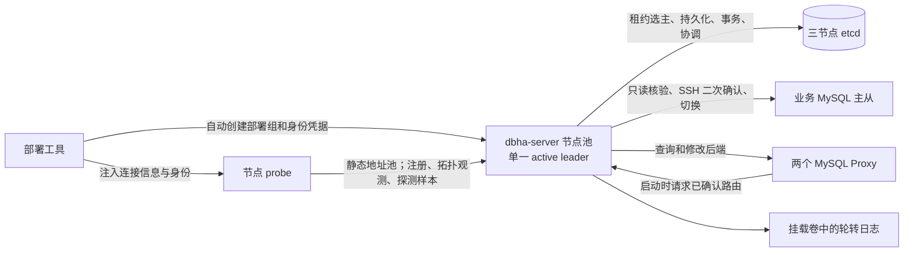

# DBHA 自动元数据上报与控制面精简 PRD

版本：1.3 · 日期：2026-09-25 · 状态：开发基线已实现，目标环境验收未完成

项目：`/Users/flyer7766/Downloads/workspace/DBHA`
代码基线：`34c5b831d0ae9fb7c9a66accaa18df51b9c524ef`
适用范围：独立 DBHA 项目；不得修改原 blueking-dbm 项目。

**用户已确认的首版范围：自动注册与元数据上报、管理数据迁入 etcd、控制服务合并为 dbha-server，并以客户端静态地址池实现不依赖 VIP 的控制端高可用。** 本文其余容量、时限、接口和异常规则是首版设计默认值。功能基线和本机 Docker 验证已经完成；目标 Linux 性能、多 controller 真实 EC2、历史快照恢复及真实旧管理库迁移仍以 `acceptance-status.md` 的记录为准，不能据此宣称生产验收完成。

## 1. 产品目标与交付边界

### 1.1 要解决的问题

当前首次部署要预置主库、备库、Proxy 的元数据；探测配置与 seed SQL 重复描述节点。IP 或角色发生变化时容易形成两份不一致的记录。控制端还要维护 admin、receiver、analysis、standalone-metadata、管理 MySQL 和 etcd 六个常驻服务。

首版交付后，操作者部署业务节点和 probe 即可自动登记受支持的集群，不再填写元数据 SQL、不手动分配 cluster_id、不定期修正主备角色。控制端仅保留 **dbha-server + etcd**；业务 MySQL、Proxy、节点 probe 继续运行。

### 1.2 “无需人工填写”的准确含义

- 无需维护独立的节点元数据清单、seed.sql、主备角色表、Proxy 关联表。
- 部署工具仍需知道要部署在哪些机器、如何连接本地 MySQL、如何建立实际复制、使用哪个控制端及凭据。这些是基础部署输入，不能凭空发现。
- 部署工具为每次集群部署自动生成部署组和加入凭据，并注入该组的两个 MySQL 节点与两个 Proxy 节点；用户不手工编写节点角色元数据。
- 实例的实际 IP/端口、MySQL UUID、复制上游、Proxy 实际后端由 probe 上报；初始主备角色必须经控制端交叉验证，不能直接使用安装脚本的角色标签。
- 不做全网扫描，不把任意连到接收端的数据库自动纳入切换范围。自动注册不等于自动开启故障切换。

### 1.3 首版必须满足的成功标准

| 编号 | 结果 |
|---|---|
| G-01 | 全新单集群与三集群部署不执行管理库 schema/seed/migrate SQL，管理 MySQL 容器不存在 |
| G-02 | 健康节点完成上报后，在本文件时限内自动登记，无需手工写 etcd 键或节点元数据 |
| G-03 | 控制端只有 dbha-server、etcd 两类常驻服务；原四个控制程序不再被默认部署启动 |
| G-04 | 主备切换后，角色、集群 ID 与路由持久化；重启控制端/Proxy 不恢复到旧主 |
| G-05 | 旧主复活、重复上报、乱序数据、UUID 冲突不能覆盖已经提交的新主 |
| G-06 | 单/三集群真实切换、Proxy 重启、控制端重启与不确定操作恢复场景有验收证据 |
| G-07 | 生产配置可运行三个 dbha-server 与三节点 etcd；客户端使用静态地址池，在无 VIP 时自动定位单一 leader 并在故障后恢复 |

### 1.4 支持范围及非目标

首版支持 MySQL 8.0.22+、GTID、一主一备、单条异步复制通道、每组两个蓝鲸定制 MySQL Proxy；必须覆盖现有单集群和三集群部署。MySQL 小版本与 Proxy 发布包在测试环境中固定并记录。首版每个 probe 对应一个 MySQL 实例，或一个 Proxy 的数据/管理端口对。

首版不支持多源复制、级联复制、双向复制、Group Replication、多备库自动选优、跨集群自动迁移、节点重建后自动替换身份、旧主自动重新加入、MySQL 5.7/8.4/MariaDB、新增数据库类型、图形界面、旧版在线无停机迁移。

保留研究环境边界：本次不增加 fencing/STONITH，不承诺网络分区下无双主或零数据丢失。etcd 的锁与事务只约束控制端及元数据，不能撤销已发往 MySQL/Proxy 的命令。首版自动切换默认关闭，只在现有受控演练前提下显式启用。

## 2. 已有能力与当前缺口

| 当前事实 | 对本需求的影响 | 证据 |
|---|---|---|
| probe 已上报实例地址、采集类型、复制上游地址/端口/服务器 ID、Proxy 后端 | 可以复用采集和传输代码 | S-01、S-02 |
| 上报的 instanceRole 来自 probe 本地配置 | 不能作为权威角色直接登记 | S-03 |
| 当前采集复制状态只使用第一条返回记录 | 新发现逻辑必须读取所有通道，多通道判为不支持 | S-04 |
| receiver 写管理 MySQL；analysis 通过 GORM 查询状态、策略、缓存和日志 | 必须完整替换管理存储路径，不能只改 metadata 后端 | S-05、S-06 |
| 接收成功目前可能仅表示已进入内存队列 | 新协议的持久化确认必须重做，不能沿用该语义 | S-07 |
| Proxy 先读元数据找主库，再启动自身和 probe | 必须调整冷启动顺序 | S-08 |
| 元数据角色交换已有事务和重复请求保护 | 新实现保留此语义并增加操作版本约束 | S-09 |
| etcd 已用于选举和分布式锁 | 复用现有 etcd 客户端依赖，新增数据命名空间 | S-10 |
| MySQL 状态解析器、主机状态解析器存在未完成逻辑 | 不宣称本项目已经能对任意 SQL/CPU 异常自动切换；保留经验证的判定链路 | S-11 |

## 3. 目标架构与职责



### 3.1 dbha-server

一个二进制、一个操作系统进程，内部包括：注册与认证、接收探测数据、拓扑协调器、故障判定与切换执行器、管理 API、现有元数据 API 兼容层、监控与日志。

对外保留两个监听端口：HTTP `8080` 承载管理/注册/路由 API，gRPC `50052` 承载上报。健康与指标使用 HTTP 下的 `/healthz`、`/readyz`、`/metrics`。默认部署运行在隔离内网，不要求 TLS；填写证书配置时仍可启用 HTTPS/TLS gRPC。原 admin gRPC `50051` 不作为首版必需入口；probe 本地连接与采集配置由部署工具生成，不新增远程配置中心。

一个统一配置对象、一套日志、一套指标注册、一个 context 生命周期、一处信号处理。不得简单并发调用四个旧 `Run` 入口；其全局 viper、logger、APM 注册及 os.Exit 行为必须在合并入口消除冲突。服务发现只注册 dbha-server。

生产环境推荐运行三个相同配置版本的 dbha-server。每个进程先启动 HTTP/gRPC，再通过 etcd 租约及环境级所有者锁竞选；同一环境始终只有一个 active leader。follower 的 `/healthz` 返回存活，`/readyz` 与业务 HTTP API 返回 `503 NOT_LEADER`、`Retry-After` 和可用的 leader 地址提示，gRPC 返回 `UNAVAILABLE/NOT_LEADER`。probe、Proxy supervisor、安装器和管理 CLI 使用静态地址池，连接失败或明确的 follower 响应才切换并缓存成功节点，因此不需要 VIP、Keepalived 或云 API。

leader 丢失租约，或 owner key 被删除/替换时，必须立即撤销 active 状态、取消进行中的请求与 reconcile，并继续竞选；所有写事务仍比较 owner 值和 lease。owner 记录绑定 etcd cluster ID，leader 周期性用同一 lease 更新 owner heartbeat；standby 必须确认 owner、lease 查询与当前读状态属于同一 etcd 集群，并在自身启动后观察到 heartbeat revision 前进，才能证明这不是快照中恢复出的旧 lease，然后再确认 etcd 状态未相对本地独立水位回退并同步水位。已有管理状态但无 owner、无动态 heartbeat 证明或无水位的节点不得自行成为 leader。接管节点不得盲目重放未完成外部操作，仍按持久化阶段和恢复门禁核验。

### 3.2 probe

复用现有采集器、health 命令及上报框架，增加实例发现、注册会话、观测版本及重试。MySQL 探测默认走本机 socket 或安装器提供的单个本地 endpoint；不扫描任意网段。Proxy probe 可先于 Proxy 数据进程启动并报告 STARTING。

probe 不修改正式角色、不直接写 etcd、不决定提升、不设置自动切换开关。Proxy 节点的 probe/入口可依据控制端返回的路由核验结果管理本机受监督 Proxy 进程，这是节点生命周期动作，不是对主库角色的任命。

### 3.3 etcd 与日志

etcd 是管理状态唯一权威持久化存储，保存身份、正式拓扑、最新观测、策略、维护状态和有限操作摘要。完整逐步日志与大快照写控制端挂载卷；不新增 Kafka、Redis、SQL 管理库或日志数据库。

生产 HA 部署使用三个 controller 上的三节点 etcd，dbha-server 配置全部 etcd endpoint；失去多数派时控制端停止写入与接管。研究 Compose 可继续使用单节点 etcd，因此本机实验仍保留存储单点，不能作为三节点 etcd 验收证据。

业务 MySQL 的连接、复制操作和 `infodba_schema` 探测/复制心跳表继续保留。去掉的是管理 MySQL 服务，不是业务 MySQL 驱动或真实复制心跳。

## 4. 用户流程

### 4.1 新建集群：正常路径

1. 操作者调用部署脚本；输入机器清单/连接凭据，或使用现有 Compose 拓扑。
2. 脚本幂等创建 deployment，自动取得 cluster_id 和默认名称 `dbha-<cluster_id>`；为四个节点各申请绑定身份的 agent_token。
3. 脚本启动实际 MySQL 主从并建立复制，向 probe 注入本地连接参数、控制端地址和 agent_token。此步骤不写节点元数据 SQL。
4. 两个 MySQL probe 注册并提交真实身份及复制观测；控制端按第 7 节核验，确认数据库拓扑。
5. Proxy probe 先注册，启动入口等待控制端路由；控制端在数据库拓扑确认后返回初始主库地址。
6. Proxy 启动后，probe 上报实际后端；两个 Proxy 连续核验一致，集群达到 READY。
7. 集群自动进入管理列表，`switching_enabled=false`。操作者按现有演练流程启用切换；不需要审批每个正常注册的节点。

已有业务主从也可接入，但必须预先具备有效复制关系和探测/控制权限。没有建立复制的两台独立 MySQL 不会自动组成主备；DBHA 不负责凭空创建复制。

### 4.2 重启与恢复

- probe 重启：保留 agent_id 和凭据，申请新会话，旧会话立即失效或在活跃冲突消失后失效；实例和 cluster_id 不变。
- dbha-server 重启：从 etcd 加载正式状态，检查未完成操作，收集新会话/新观测；完成恢复检查前不切换。
- Proxy 重启：从控制端取得当前已提交路由，不能回退到安装时的主库地址。
- 故障旧主复活：登记为已知实例的 RETURNED_UNVERIFIED，继续上报，但不能恢复 ACTIVE、抢回 primary 或自动加入复制。
- 不支持的复制结构：展示具体原因，停止该集群自动纳管和自动切换，不影响其他部署组。

### 4.3 信息展示与操作入口

使用 `dbha-server ctl ...` 子命令调用管理 API，无新增常驻 CLI 服务。至少提供 deployment 创建、agent 凭据签发/撤销、cluster 列表/详情、开启/关闭切换、维护开关、实例退役、操作详情和故障恢复确认。

集群详情必须展示：正式主备、观测到的上游、两个 Proxy 的配置/实际路由、观测年龄、纳管状态、健康状态、阻塞原因、topology_epoch、进行中的 operation_id。每个实例展示证据来源；不得把“observed_primary”标为“已确认主库”。

## 5. 身份、部署组与配置契约

### 5.1 稳定身份

| 字段 | 产生者 | 规则 |
|---|---|---|
| environment_id | 安装器初始化控制端 | 环境内固定，隔离不同研究部署；写入持久配置 |
| deployment_id | 控制端 | UUID；表示一次两 MySQL、两 Proxy 的部署组；安装器自动分发 |
| cluster_id | 控制端 | 正整数，etcd CAS 分配并与 deployment 原子绑定；同组只分配一次 |
| agent_id | 安装器申请身份时 | UUID；持久保存于节点，不能随进程重启变化 |
| boot_id / boot_generation | probe 启动时 | 每次启动新 UUID；本地持久计数器原子递增 generation，不能回退 |
| session_id / session_epoch | 控制端注册响应 | 绑定 agent/boot，epoch 单调增加；旧会话不得再写 |
| MySQL instance_id | 控制端登记时 | `mysql:<server_uuid>`，在 environment 内唯一；与 agent 身份分离 |
| Proxy instance_id | 安装器/本地 probe | 持久 UUID，与代理数据/管理端口绑定；不拿当前后端地址当身份 |

`server_uuid` 是 MySQL 数据目录身份，正常重启通常不变；复制数据目录可能复制 UUID。相同 UUID 来自两个活跃 agent/endpoint 时必须冲突隔离，不覆盖旧实例。新 UUID 出现在旧 endpoint 时视为重建的新实例，首版不自动替换旧成员。

agent_id、session_id、观测时间不能用 IP 代替。集群 ID 不由“当前主库地址/UUID”计算，否则切换会改变集群身份。

### 5.2 部署组是自动生成的归属边界

首版不实现跨 deployment 的图合并。安装器为一组业务资源自动创建 deployment，固定成员预算 `mysql=2, proxy=2`；为各 agent 发放 allowed_kind 和 deployment 绑定的凭据。不得在后续观测中覆盖归属。

这一边界解决空 Proxy 尚无后端时无法推断其属于哪个集群的问题，也避免相邻集群误配复制上游时被自动合并。复制上游落在其他 deployment 时，该组进入 CONFLICT。部署工具已有机器清单可以用于分发凭据，但不能预写主备角色或替代数据库侧事实核验。

### 5.3 凭据与最小配置

- 安装器使用管理权限调用控制端，为 agent 自动生成至少 256 bit 随机 token；服务端仅保存 token 摘要，绑定 environment、deployment、agent、allowed_kind。首次返回后由安装器写入节点权限为 0600 的文件。
- probe 注册和上报使用同一 agent_token；注册不再交换另一个可能在响应丢失时无法恢复的秘密。签发响应丢失时安装器撤销该凭据并重新签发，不猜测已交付状态。
- agent_token 只能操作自身观测和读取自身组的启动路由；不能调用策略、角色提交、启用切换或其他 agent 接口。
- 安装器幂等键用于重跑恢复 deployment/agent 身份；生成结果保存在部署状态目录，不进入 Git。不把 server_uuid/节点密码作为幂等键。
- agent_id 由安装器在请求签发前生成并落盘。凭据签发响应丢失时，通过已知 agent_id 调用管理员 rotation 接口，撤销旧凭据后生成新凭据；不得为了取回秘密重复创建 agent、突破成员预算。
- 默认在隔离内网使用 HTTP/gRPC 和 bearer token 鉴权；可选 TLS 模式校验控制端 CA。MySQL/Proxy/SSH 凭据仍只在需要执行对应操作的节点或控制端配置中保存，不进入观测 JSON、etcd 元数据或普通日志。
- 对 MySQL 仅做新增发现所需的权限为连接权限及 REPLICATION CLIENT；已有心跳写入、Proxy 管理、切换和 SSH 权限另列安装清单，不声称只读发现账户足以执行所有现有功能。

管理员身份与 agent 身份分开：首次控制端初始化在权限 0600 的本地文件生成管理员 token，etcd 保存摘要；管理 CLI 在隔离内网通过 HTTP 使用此 token，可选 TLS 模式通过 CA 校验 HTTPS。首版一个管理员权限级别，允许部署、凭据、策略、维护、开关和恢复操作；agent token 一律不能获得管理员权限。每次管理写操作记录身份标识、目标、request_id、预期/结果版本和结果，不记录 token。管理员凭据轮换必须保留一条可用的本地受控恢复路径，不能把管理员明文放进 etcd 快照。

probe 首版配置的必要输入只有：server HTTP/gRPC 地址池、agent_id、token 文件、本地 MySQL socket/endpoint 与凭据文件，或 Proxy 的本地配置位置、数据/管理端口及凭据文件。单地址旧字段继续兼容。启用 TLS 时额外配置 CA。advertise_address 由安装器从实际部署网络注入；无法唯一判断多网卡/NAT 地址时拒绝猜测并显示 ADDRESS_UNRESOLVED。

## 6. 上报协议与持久化确认

### 6.1 注册会话

`POST /api/v1/agents/register`，Bearer 为 agent_token。请求包含 `schema_version=1, agent_id, boot_id, boot_generation, probe_version, capabilities`。控制端从 token 取得 deployment，忽略/拒绝客户端试图指定其他组。

首次注册/新会话返回 201；仅当 agent_id+boot_id+boot_generation 仍是当前未关闭会话时，重复请求返回 200 和原 session，不递增 epoch。小于已记录 generation 的注册一律返回 409 BOOT_SUPERSEDED；相同 generation 对应不同 boot_id 返回 409 BOOT_CONFLICT；主动关闭的同一 boot 不得重新开启，需下一 generation。

更高 generation 与仍活跃会话竞争时返回 409 SESSION_ACTIVE；旧 probe 正常退出可主动结束会话，异常退出则等待 30 秒没有新有效联系后接管。接管事务比较旧 active session/epoch、last_contact_at 的 revision 和凭据未撤销状态，原子写新会话及更高 generation；成功上报会更新同一 agent 记录，使基于旧联系时间的接管 CAS 失败。服务端不得仅依赖内存计时决定接管。节点身份文件丢失不能把 generation 重置为 1 冒充原身份，需维护轮换/重置身份。

```json
{
  "agent_id": "72fb5c9c-7e4d-4eb2-b097-7d71e0c99fd1",
  "session_id": "5661589c-3abd-4d31-8d46-e0378072811f",
  "session_epoch": 3,
  "deployment_id": "ee9085cf-633c-4d5d-bcbb-c0d724f6b12e",
  "cluster_id": 101,
  "topology_interval_ms": 5000,
  "session_idle_timeout_ms": 30000
}
```

会话在控制端重启后也必须校验；因服务端恢复门禁要求新观测，并不需要重发身份凭据。复制 agent 的凭据文件属于身份冲突，不能通过不断抢占 session 自愈。

### 6.2 gRPC 方法

复用现有 gRPC 依赖，在新服务 `DiscoveryService` 中定义两个 unary RPC：`PushObservation` 和 `PushSample`。JSON 示例表达字段名和语义，实现时在仓库 `.proto` 中固化类型并提交生成代码。

| RPC | 用途 | 频率/最大单条负载 |
|---|---|---|
| PushObservation | 完整实例身份与拓扑观测，包括失败/未就绪事实 | 启动立即发送，之后 5s；64 KiB |
| PushSample | 复用采集分组的最新指标/事件数据 | default 5s、heartbeat 1s、repldelay 5s；128 KiB |

共同信封：`schema_version, agent_id, session_id, session_epoch, instance_id, stream, sequence, sampled_at, collection_duration_ms, payload`。首次还未获得 instance_id 的观测使用自然身份 mysql.server_uuid 或 proxy_uuid；响应返回正式 instance_id。stream 是 `topology/default/heartbeat/repldelay`，sequence 在 session 内按 stream 独立递增，使用 uint64。

MySQL 首次发现/采集失败且没有 server_uuid 时，仅提交 agent 级错误状态，不创建猜测出的实例。未知 instance 的指标不能创建正式拓扑，返回 FAILED_PRECONDITION，probe 优先完成观测注册。

MySQL payload 必填字段：

| 字段 | 类型 | 含义 |
|---|---|---|
| kind | enum | mysql |
| advertise_host / port | string / uint32 | 控制端和 Proxy 实际可访问地址；不能用本地 socket 路径冒充 |
| server_uuid / server_id / version | string / uint64 / string | 实例身份和产品版本 |
| read_only / super_read_only / gtid_mode | bool / bool / string | 仅作事实，不是主库任命 |
| replication_query_state | enum | OK / ERROR；ERROR 时不把空通道列表当作无上游 |
| channels | array | 所有通道，含 channel_name、source_uuid、source_host、source_port、io_running、sql_running |
| collection_state / error_code | enum / string | OK、ERROR 等；错误信息去除凭据 |

复制权限不足、查询超时、字段不支持与真正返回零通道必须严格区分。首版多于一个通道返回 UNSUPPORTED；已配通道但 Source_UUID 为空时保持 DISCOVERING，不仅凭 Host 推断主库。

Proxy payload：`kind=proxy, proxy_uuid, advertise_host, data_port, admin_port, process_state, backend_query_state, backends[]`。每个 backend 包含 address/state/type；UUID 若代理提供则作为辅助字段，不冒充 MySQL 身份证据。Proxy 未启动可上报 STARTING + NOT_READY + 空 backends；不能按“无后端”删掉正式关系。

成功响应包含 `instance_id, accepted_sequence, stored_revision, duplicate, topology_state, reason_codes[]`。Proxy 响应可额外包含 `route_reconcile_required` 和 `authoritative_topology_epoch`，只表示本机需进入第 7.2 节的停止/重新许可流程，不携带任意执行命令。拓扑尚未确认也可接收观测并返回成功；成功表示观测已持久化，不表示已经自动启用切换。

### 6.3 幂等、乱序和确认语义

- 同 session/stream 的较小 sequence：拒绝 OUT_OF_ORDER，不刷新新鲜度。
- 相同 sequence、相同规范化 payload 摘要：返回上次结果，`duplicate=true`，不增加 revision、不刷新 received_at。
- 相同 sequence、不同 payload：拒绝 SEQUENCE_CONFLICT，记录诊断。
- 旧 session/epoch：拒绝 SESSION_EXPIRED，不更新任何实例、角色或时间戳。
- 返回成功前，在同一 etcd 事务中比较 active session/epoch 和凭据未撤销状态，提交最新值、去重信息、agent.last_contact_at；成功采样同时更新 last_valid_report_at。失败采集只更新联系/错误状态。接管事务与此写入互斥。不得以进入内存队列作为成功。
- 超时不等于未写入；probe 可在样本年龄允许时重试原 sequence。样本过期后丢弃待发旧样本，重新采集并使用新 sequence；不回放离线历史制造“新鲜”。
- 服务端最多保留每实例/stream 最新待处理值；全局待写队列上限 1024 条且不超过 8 MiB，任一达到即背压。不能无界积压。
- gRPC UNAUTHENTICATED/PERMISSION_DENIED 不盲目重试；RESOURCE_EXHAUSTED/UNAVAILABLE 按 1、2、4、8、最多 30s 抖动退避；session 过期走注册。

### 6.4 时间与新鲜度

服务端保存 sampled_at、received_at、collection_duration、session_epoch、sequence。首版控制端与节点要求时钟同步；采样时间与接收时间差超过允许范围（过去 15s、未来 5s）拒绝为 STALE_SAMPLE/CLOCK_SKEW。只有新 sequence 的成功采样可作为健康/拓扑确认的新证据；失败采集可更新联系时间及错误状态，但不延长上次有效事实的年龄。

默认：拓扑有效样本 ≤15s；普通/复制指标 ≤30s；心跳指标 ≤10s。实际决策同时检查采样时间和接收时间，不能只看键是否存在。新鲜窗口是配置值，不能短于两次采集间隔。控制端重启后，所有用于首次决策的候选/路由节点必须有重启后收到的新有效样本。

租约保活只表示协调会话仍在，不证明采集成功。指标过期不会删除持久身份、角色或切换记录，也不能单独触发提升。

## 7. 自动拓扑确认与状态机

### 7.1 初始 MySQL 拓扑确认

一个 deployment 必须满足全部条件，连续三个有效观测轮次、跨度至少 10s 后，才能自动确认初始主备：

1. 恰好两个已授权、身份不冲突的 MySQL 实例；均在组允许的部署网络内。
2. 两者 server_uuid 不同，GTID=ON；控制端使用控制凭据对上报 endpoint 只读连接，核验 UUID 与本地上报相同。凭据不允许由报告临时指定。
3. 恰好一个实例有一条复制通道，Source_UUID 与另一实例匹配，源端口及可解析地址一致；该复制 IO/SQL 线程正常，延迟满足配置上限。
4. 另一实例复制查询成功且无上游；它是候选主库。候选备库必须 read_only=ON；候选主库须通过可写状态校验。单靠 read_only=OFF 或零通道均不构成主库证明。
5. 控制端能够执行现有探测健康/SSH 检查，且没有未完成切换、维护状态或冲突证据。

确认时 CAS 写入 cluster 正式记录及成员索引，初始 topology_epoch=1。不得由 probe 的 instanceRole 字段决定；该旧字段在新路径中仅作为诊断信息或忽略。

### 7.2 Proxy 首次启动与路由

1. 新入口先启动注册/探测进程及 SSH，不以 Proxy 进程存在为 probe 存活前提。
2. Proxy probe 用持久 proxy_uuid 注册 STARTING，即使尚无 backends 也能登记为组内候选 Proxy。
3. MySQL 拓扑达到 DATABASES_CONFIRMED 后，启动入口为本组 Proxy 申请 start permit；控制端将启动意图与当前 epoch 持久化。
4. 响应返回新鲜、已确认的主库 endpoint、topology_epoch、permit_id 和截止时间；启动入口启动前复核许可，按响应生成临时 Proxy 配置并启动。
5. 启动后读取实际 backends 并调用 complete；控制端独立读回后端、核对 epoch 后释放许可。两个 Proxy 都连续三个有效轮次指向已确认主库，集群达到 READY。
6. 控制端不可用/路由未确认时，入口等待并退避，绝不使用 seed 中的旧地址。进程保持可诊断的 WAITING_ROUTE，不进入无意义的反复重启。

这里“初始路由允许下发”只要求数据库拓扑确认，不能要求两个 Proxy 已经 READY，否则仍会形成循环依赖。

`route_ready` 精确定义：topology_state 为 DATABASES_CONFIRMED 或 READY，operation_state=IDLE，协调所有权有效，已确认主库有新鲜有效样本且控制端核验其身份/角色符合正式记录，无角色冲突，recovery_gate=NONE。STARTUP_VALIDATION 是例外：在正式数据库角色已经通过重启后的只读核验、且无非终态外部操作时可下发路由，允许 Proxy 启动来完成整组恢复。MIGRATION_UNVERIFIED 和 RESTORE_UNVERIFIED 期间一律不下发，须先完成对应维护核验。启用切换不是获取初始路由的前提。

`GET route` 是只读查询，不能作为绕过启动许可的授权。`POST start-permits` 与切换 PREPARED 使用同一 cluster CAS 门禁：存在 active_operation 时不得签发；存在未完成许可时不得开始切换。多个 Proxy 可在同一 epoch 各持有许可。许可默认有效 60s；入口迟到不能启动，必须停止其已启动的受控进程并报告。超时许可不能仅因 TTL 到期便释放切换门禁，需控制端核验该 Proxy 已停止或已指向当前正式主库后取消/完成；无法核实时进入 RECOVERY_REQUIRED。这样避免拿到旧地址后延迟启动与同时切换互相穿越。

切换后未重启而重新联网的 Proxy 同样必须核验：若实际 backend 不等于正式主库，将该 Proxy 标为 ROUTE_MISMATCH，不纳入健康入口；在新的有效观测响应中置 route_reconcile_required，节点 probe 只允许请求停止配置中明确受监督的本机 Proxy PID，入口负责确认停止、申请新许可、重新启动。SSH/probe 本身继续运行，不能依赖整个容器死亡后由外部人工重启。首版不依赖 Proxy 热重载即可完成此流程。网络分区期间控制端无法保证远端入口已经停止，该局限仍属于第 1.4 节的无 fencing 边界；连接恢复后的纠正必须在 15s 内开始，不能只告警后继续认可旧路由。

### 7.3 状态分层

| 维度 | 值 | 规则 |
|---|---|---|
| topology_state | DISCOVERING / DATABASES_CONFIRMED / READY / CONFLICT / UNSUPPORTED / RETIRED | 表示拓扑证据与纳管结果 |
| health_state | HEALTHY / DEGRADED / UNKNOWN | 由新鲜观测派生；离线不清除正式拓扑 |
| operation_state | IDLE / SWITCHING / RECOVERY_REQUIRED | 控制正在执行/待核实的外部操作 |
| instance_admission | CANDIDATE / ACTIVE / RETURNED_UNVERIFIED / QUARANTINED / RETIRED | 约束实例是否可参与切换 |
| switching_enabled | false / true | 管理员显式改变，初始为 false |
| recovery_gate | NONE / STARTUP_VALIDATION / MIGRATION_UNVERIFIED / RESTORE_UNVERIFIED | 与拓扑状态独立；非 NONE 时不能开始切换；不同门禁的路由规则见下文 |

正常初始迁移：DISCOVERING → DATABASES_CONFIRMED → READY。已 READY 集群发生节点离线时保持正式成员及 topology_state，health 降级；不得回到 DISCOVERING 并重新选主。

CONFLICT 可在初始角色尚未提交、证据恢复一致并满足三轮规则后自动重新评估；正式拓扑已建立后的 UUID/归属/角色冲突不自动重写成员，需维护流程解决。UNSUPPORTED 只有实际结构恢复为支持范围后才能重新评估。

`ready_for_switch` 是派生结果，必须满足 READY、IDLE、switching_enabled、recovery_gate=NONE、协调锁有效、无维护/冲突/未完成 Proxy 启动许可，以及备库和参与切换的 Proxy 有新鲜有效数据。故障主库可以缺少新鲜样本，否则真实主机故障永远无法切换；该缺失必须继续走现有二次确认和策略，不能直接提升。

首版至少一个可用 Proxy 才能切换；初始 READY 验收仍要求两个。不可达 Proxy 不计作已完成路由更新，需记录 DEGRADED，重启必须重新获取已提交路由。此规则不提供网络分区隔离保证。

### 7.4 旧主、重建、地址变化和删除

- 已被切换出主角色且标为 unavailable 的实例再次出现，进入 RETURNED_UNVERIFIED；上报 read_only=OFF 或无上游不能覆盖新主。需要人工修复实际复制，再通过维护接口核验后恢复 ACTIVE。
- 相同 UUID、同一 agent 的地址变化不能只凭上报覆盖可操作 endpoint；首版先暂停该实例纳管，维护操作只读验证新地址后 CAS 更新，集群 ID 保持不变。
- 相同 endpoint、新 UUID 表示新实例候选；不继承旧主角色或旧成员身份。首版通过维护替换流程处理。
- probe 心跳丢失不自动删除实例。显式 retire 要求 switching_disabled、无进行中操作，并保留 tombstone；后续旧凭据报告返回 INSTANCE_RETIRED。

## 8. etcd 数据契约

命名空间固定为 `/dbha/v1/<environment_id>/`，与原注册/锁前缀隔离。值采用带 `schema_version=1` 的 JSON；禁止保存数据库密码、SSH 密码和 agent 明文 token。

| 相对路径 | 内容/写入者 | 生命周期 |
|---|---|---|
| schema | schema 版本、最低协议版本 | 持久 |
| counters/cluster-id | 分配 cluster_id 的 CAS 计数器 | 持久 |
| deployments/{id} | cluster_id、幂等键、2+2 预算、允许网络/凭据 profile 引用 | 持久 |
| credentials/{credential_id} | token 摘要、agent/deployment/allowed_kind、撤销状态 | 持久 |
| agents/{agent_id} | 身份、最高 boot_generation、active boot/session/epoch、last_contact_at、last_valid_report_at | 持久 |
| instances/{instance_id} | 身份、agent、deployment、endpoint、admission | 持久 |
| endpoint-index/{encoded-endpoint} | instance_id，包含 kind/端口，唯一占用索引 | 持久，CAS 同步维护 |
| clusters/{cluster_id} | 正式成员、primary_id、standby_id、Proxy IDs、epoch、状态、维护、开关、recovery_gate、active_operation_id、active_start_permits | 持久；≤32 KiB |
| observations/{instance_id}/topology | 最新有效观测及最近错误/时间、会话和去重信息 | 覆盖写，不挂长保活 lease |
| samples/{instance_id}/{stream} | 最新指标/事件及时间、会话和去重信息 | 覆盖写，不积累全历史 |
| policies/{scope}/{id} | 默认/业务策略、版本；scope 为 global 或业务 ID | 持久 |
| exclusions/{instance_id} | 跳过/维护原因及到期策略 | 持久；到期需显式评估 |
| operations/{operation_id} | 切换阶段、输入 epoch、候选、步骤意图/确认、最终结果 | 非终态永不自动清理；终态保留最多 7 天且最多 1000 条，按较早触发的限制清理；清理后该 ID 不能作为新操作重建 |
| coordination/server-owner | 控制端所有者 | 30s 租约，10s 续约 |
| coordination/switch/{cluster_id} | 切换执行锁 | 租约；与 operation 关联 |

cluster 正式角色集中在一个小记录中，避免读出“一半已经交换”的拓扑。instance 记录不另设可独立修改的 authoritative_role。对外角色通过 cluster 记录计算。

每次需要同时修改 cluster、operation 或 endpoint 索引，使用 etcd Txn 比较 mod_revision、session_epoch 或预期 topology_epoch 后提交。冲突后重新读取并校验，不做无条件覆盖。只更新观测不得增加 topology_epoch；成员/角色/正式路由变化才增加。

缓存可用于展示和定时扫描。发起切换、角色提交、启动路由必须读取满足一致性要求的最新正式记录，并复核操作状态。多个前缀分页读取应固定同一 revision；watch 被压缩时全量重建，在完成重建前关闭切换就绪状态，不能沿用缺项缓存。

持久化默认值：etcd 历史自动压缩 1h，管理数据配额沿用部署明确配置（默认 2 GiB）；容量达到 70% 告警、90% 禁止发起新切换并告警。快照每日一次、保留最近 7 份；备份目录与控制日志分离。压缩、碎片整理、快照恢复步骤必须随部署手册交付。即使只覆盖同一键，历史 revision 仍需压缩。

完整切换日志按 operation_id 输出 JSON Lines；默认 20 MiB × 10 个轮转文件，目录持久挂载。关键操作意图/结果写 etcd operation 成功才继续下一外部步骤；文件写入失败需告警，但文件不是角色提交的唯一依据。旧 admin 的任意 SQL 日志检索不要求原样保留；首版提供按 operation_id 和最近摘要查询。

## 9. 切换、角色提交及不确定状态

### 9.1 权威边界

初次角色由自动拓扑确认器提交。此后角色仅由切换执行器或经过维护校验的恢复操作更新。probe、兼容 update-status、通用管理 PATCH 都没有直接改 primary_id 的权限。

确认主库是“控制端决定的业务路由目标”；只读位、复制图和 Proxy 后端是事实。事实与决定不一致时产生冲突/恢复任务，不能自动用最后一份报告覆盖决定。

### 9.2 操作记录与执行顺序

每次切换生成 operation_id，在第一个外部动作之前持久记录旧主、候选、拓扑 epoch、参与 Proxy 集合和输入证据 revision；CAS 将 cluster 置为 SWITCHING。复用当前复制检查与切换核心，但每个外部步骤需要可观测的前后条件。

| 阶段 | 完成条件 |
|---|---|
| PREPARED | 锁/所有权及门禁通过，操作意图持久化 |
| ROUTES_BLOCKED | 对参与的可用 Proxy 执行阻断路由并核验；不能把 RPC 超时当作未执行 |
| PROMOTED | 备库提升动作完成，并核验实际 UUID、复制状态及可写条件 |
| ROUTED | 参与 Proxy 已指向候选并读回核验；离线 Proxy 单列未完成状态 |
| COMMITTED | 一个 etcd 事务更新 primary/standby、旧主 admission/status、topology_epoch、操作终态并清除 active_operation_id |

每一外部步骤包含 `intent_written / action_started / verified` 标记。内部切换执行入口的幂等键为 operation_id，保留期内重复调用返回已记录结果；不再次交换角色或再次提升。首版不新增任意外部调用者可直接触发提升的 API。执行入口只接受已存在且门禁合法的 PREPARED 操作；摘要清理后该 ID 返回 OPERATION_NOT_FOUND，不得以相同 ID 重建或再次执行。分配新 operation_id 与基于实时证据准备新操作是单独的控制端流程。

以下条件进入 RECOVERY_REQUIRED：外部命令结果不明、提升后无法持久记录、锁/所有权丢失时有执行中动作、进程重启发现非终态操作、部分 Proxy 路由不明确。进入后停止新的切换，路由 API 不提供未核实地址。

**etcd 原子提交不覆盖 MySQL/Proxy 外部副作用。** 锁失效不能撤销已发送 SQL；首版不声称严格 fencing。恢复流程先只读核验实际主库与 Proxy，返回证据，再由维护命令 `resolve-operation` 指定完成或终止，带 expected_epoch；证据冲突时拒绝。不得盲目自动回滚到旧主。

### 9.3 重启与 etcd 故障

- etcd 不可读/不可写或出现 NOSPACE：readyz 失败、上报不返回持久化成功、停止新切换。已有 Proxy 路由不因控制端故障被自动重写。
- 正在执行时尽快在下一动作前终止，标记结果不明；无法写标记则以非终态 operation 在恢复时识别。不能声称总能在失联瞬间停止已发命令。
- 控制端恢复后检查 operation、正式 epoch 和数据库事实，并取得新探测样本；完成一致性检查前不自动开启新的切换。
- etcd 从历史快照恢复必须执行下述恢复协议；旧快照不能成为 Proxy 启动的可信新主依据。

恢复协议：控制端在独立于 etcd 数据卷的挂载卷 `/var/lib/dbha-server/control-watermark.json` 保存已核验的 etcd cluster ID、最高 revision 和各集群已提交 topology_epoch；每次成功角色提交后原子落盘并 fsync。该文件不作为数据库状态来源，只用于发现回退；写入失败设置恢复门禁并停止新的切换。

部署提供受控恢复命令，要求停止 dbha-server，在至少一个 controller 的独立卷先持久写入带随机代次的 `restore-required` 标记，再恢复 etcd 快照。该标记允许水位不匹配的节点取得恢复 owner，但 `prepareRecovery` 必须先把所有集群置为 RESTORE_UNVERIFIED 且关闭切换；无标记节点不能绕过旧水位竞选。standby 仅在确认当前 etcd cluster ID、owner lease 和动态 heartbeat 一致，且全部集群仍处于 RESTORE_UNVERIFIED 后，才可用恢复后的水位替换旧 cluster ID/revision/epoch，从而安全接替恢复 leader。消费标记时先把标记代次写入原子水位，再删除并 fsync 状态目录；删除失败或中间崩溃留下的同代标记不得再次触发恢复门禁，新一次恢复命令生成的新代次才是有效授权。启动发现未消费标记、etcd cluster ID 改变、revision/epoch 小于水位、或非空 etcd 却丢失水位时，进入 RESTORE_UNVERIFIED。全部情况仍接收经认证的新上报，便于只读核验，但不能对 Proxy 签发路由许可。管理员执行 restore-reconcile：只读核验实际 MySQL/Proxy、解决非终态操作和角色冲突、以 CAS 保存恢复后的正式状态及关闭的切换开关、更新水位，最后清除标记。此后才能重新申请路由和显式启用切换。

普通重启使用 STARTUP_VALIDATION：加载水位和正式状态、检查操作、收集重启后的新观测、核验数据库角色后允许启动路由，完整核验结束再置 NONE。完整核验针对当前 ACTIVE 主库/参与路由成员；已记录为 unavailable/RETURNED_UNVERIFIED 的旧主可以继续离线，不因此重新任命角色或无限阻塞新主路由，但缺少可用备库时 ready_for_switch 必须为 false。水位不是跨 etcd 与文件的原子提交；即使崩溃发生在两次写入之间，也不能跳过每次启动的事实核验。新建环境仅在 etcd 命名空间与控制端状态卷均为空时允许初始化。绕过恢复工具并同时回退/删除所有独立状态的灾难恢复不作自动判断，必须走管理员恢复核验。

## 10. API 与兼容规则

HTTP API 统一响应：成功为 `{"data": ..., "revision": "<etcd revision>"}`；失败为 `{"error":{"code":"...","message":"...","retryable":false},"request_id":"..."}`。revision 使用十进制字符串防止不同客户端的整数精度问题。旧兼容 API 保留既有响应包络，不强制改成此格式。

| 方法与路径 | 调用者 | 核心契约 |
|---|---|---|
| POST /api/v1/deployments | 安装器/管理 CLI | Idempotency-Key 必填；自动分配部署组和 cluster_id；仅含 2+2 预算、环境、网络/凭据 profile，不提交节点角色 |
| POST /api/v1/deployments/{id}/agents | 安装器/管理 CLI | 生成绑定组、agent 和 allowed_kind 的 token，明文只返回一次；不得超过预算 |
| POST /api/v1/agents/{id}/credentials/rotate | 管理 CLI/安装器 | 撤销该 agent 旧凭据，签发新 token；需要 request_id；响应丢失按 agent_id 再次轮换，不创建新 agent |
| POST /api/v1/agents/{id}/credentials/revoke | 管理 CLI | 幂等撤销该 agent 凭据及会话；不删除正式成员 |
| POST /api/v1/agents/register | probe | 第 6.1 节会话协议 |
| POST /api/v1/agents/session-close | probe | 只结束自己的当前会话；幂等 |
| GET /api/v1/clusters | 管理 CLI | 列表及阻塞原因，游标分页，默认 50、上限 100 |
| GET /api/v1/clusters/{id} | 管理 CLI | 正式拓扑+观测+状态，含 topology_epoch |
| GET /api/v1/clusters/{id}/route | 本组 Proxy 身份 | 仅在 route_ready 时返回 current_primary 和 topology_epoch；不接受调用者指定主库 |
| POST /api/v1/proxies/{id}/start-permits | 本 Proxy 身份 | request_id 幂等；CAS 登记启动意图并返回 permit/epoch/endpoint/deadline；与切换门禁互斥 |
| GET /api/v1/proxies/{id}/start-permits/{permit_id} | 本 Proxy 身份 | 启动前确认许可、epoch 和截止时间；不续期已过期许可 |
| POST /api/v1/proxies/{id}/start-permits/{permit_id}/complete | 本 Proxy 身份 | 上报启动完成或已停止；控制端独立核验后完成/取消；超时不自动解除门禁 |
| PUT /api/v1/clusters/{id}/switching | 管理 CLI | expected_epoch、enabled；缺少就绪证据拒绝启用；关闭始终可请求但不声称撤销进行中动作 |
| PUT /api/v1/clusters/{id}/maintenance | 管理 CLI | expected_epoch、enabled、reason；开启后禁止新切换 |
| POST /api/v1/instances/{id}/retire | 管理 CLI | 第 7.4 节前提、expected_epoch；保留 tombstone |
| GET /api/v1/operations/{id} | 管理 CLI | 当前阶段、步骤验证、结果、日志索引 |
| POST /api/v1/operations/{id}/resolve | 管理 CLI | 仅维护模式，resolution=complete/abort、expected_epoch；服务端重新只读核验，不接受客户端伪造成功证据 |
| POST /api/v1/recovery/reconcile | 管理 CLI | 指定 migration/restore gate 和各 cluster 的 expected_epoch；只读核验后 CAS 提交恢复结果、保持切换关闭，再更新独立水位/标记；失败不解除门禁 |
| GET /api/v1/policies | 管理 CLI | 按 global/业务 scope 列表，游标分页 |
| GET /api/v1/policies/{id} | 管理 CLI | 读取策略内容与资源 revision |
| PUT /api/v1/policies/{id} | 管理 CLI | 创建/更新现有策略模型支持的字段；创建要求不存在，更新要求 If-Match revision；非法触发器/动作拒绝 |
| DELETE /api/v1/policies/{id} | 管理 CLI | If-Match 必填；不改变已经 PREPARED 的策略快照 |
| GET /api/v1/exclusions | 管理 CLI | 查看跳过/维护项与原因 |
| PUT /api/v1/exclusions/{instance_id} | 管理 CLI | If-Match 或 If-None-Match 创建；reason 必填；只能引用已登记实例 |
| DELETE /api/v1/exclusions/{instance_id} | 管理 CLI | If-Match 必填，清除排除项不自动恢复未核验旧主的 ACTIVE |

策略模型复用现有触发事件、原因、次数、优先级、范围、动作和启用状态，不新增任意 SQL/脚本策略。默认策略仍由初始化工具幂等写入；查询/变更需要管理员权限。排除项若设置过期，只能转为待核验，不能绕过 RETURNED_UNVERIFIED。管理 API 的 expected_epoch 用于正式拓扑并发控制；策略、排除项等非拓扑资源用各自 If-Match revision。若缺失并发前提返回 428，版本不匹配返回 409，不能最后写入覆盖。

地址/实例替换与旧主恢复由同一维护 CLI `reconcile-instance` 发起，对应 `POST /api/v1/instances/{id}/reconcile`；请求只指定待验证的新 endpoint 或 replacement_instance_id，不允许直接指定 primary。该操作要求关闭切换、无进行中操作，并验证实际复制指向已确认主库；核验失败返回具体原因。首版不自动执行 CHANGE MASTER 或重建数据。

返回码：400 格式/字段错误；401 凭据无效；403 越权；404 资源未知/摘要已清理；409 会话/版本/身份冲突；412 前提不足；413 过大；428 缺少并发前提；429 限流；503 etcd/控制端未就绪。route 未就绪返回 503 ROUTE_NOT_READY，不返回可用地址。错误响应不得包含 token、密码或带凭据 DSN。

必须定义并可测试的原因码：WAITING_MYSQL、WAITING_SOURCE_UUID、WAITING_PROXY、PROBE_STALE、CLOCK_SKEW、REPLICATION_QUERY_FAILED、MULTI_CHANNEL_UNSUPPORTED、CROSS_DEPLOYMENT_SOURCE、UUID_CONFLICT、ENDPOINT_CONFLICT、ADDRESS_UNRESOLVED、ROLE_CONFLICT、RETURNED_PRIMARY、ETCD_UNAVAILABLE、STORAGE_PRESSURE、OPERATION_UNCERTAIN、BOOT_SUPERSEDED、BOOT_CONFLICT、ROUTE_MISMATCH、START_PERMIT_EXPIRED、OPERATION_NOT_FOUND。

兼容策略：

- 独立首版不恢复 DBM/DBHA v1 的远程白名单依赖；使用本地策略和 exclusions。旧库导入若遇到无法等价表达的启用规则，导入预检必须报错列出，不能悄悄丢弃后启用切换。
- 保留 `/api/v1/metadata` 的读取契约，数据来自已确认 cluster + instance；DISCOVERING/CONFLICT 等不得伪装成可切换实例返回给旧逻辑。
- 原 `/api/v1/update-status` 与 `/api/v1/swap-mysql-role` 若保留，只允许控制身份；swap 必须关联已存在 operation_id 和 expected_epoch。无操作上下文的旧调用返回 412，而不是无条件角色切换。新切换器优先直接调用内部模块，不进行无意义的本进程 HTTP 回环。
- 原业务/云 ID 在独立部署默认值分别为 1/0，城市字段给固定独立环境默认值；cluster 名称使用自动生成名称；这些兼容字段不要求用户手填。返回契约需通过现有 dbm 客户端测试。
- 新默认部署仅接受带会话及认证的新上报协议。旧 PushDataUnary 不得默默用于自动登记；返回 UNIMPLEMENTED/明确迁移错误。升级要求服务与 probe 成组升级，首版不承诺混合版本兼容。
- 不实现旧 admin 全部 API 的逐项兼容；保留必要策略读取与维护能力，旧运维入口变更必须列在迁移文档中。

## 11. 功能需求与开发责任

| ID | 需求 / 完成标准 | 主要代码责任 |
|---|---|---|
| FR-01 | 每个统一控制进程正常启停，无全局配置/指标重复注册冲突；有统一健康就绪 | 新 cmd/server，复用/调整 internal/{admin,receiver,analysis} 的可调用模块 |
| FR-02 | 部署组、agent 凭据及幂等安装；默认无管理 MySQL/seed/migrate 服务 | deploy/dbha-v2、ec2、Makefile |
| FR-03 | MySQL UUID、所有复制通道、只读状态完整采集，区分失败与零结果 | internal/probe/harvester/mysql、pkg/storage/haprobe |
| FR-04 | Proxy 可在数据进程前注册并等待路由 | probe 配置/采集、两个 Proxy 入口脚本 |
| FR-05 | 认证会话、分 stream 顺序、幂等、大小限制、持久化确认和背压 | pkg/proto/idl、probe/client、新接收模块 |
| FR-06 | 自动确认主备与 Proxy 归属，状态机、三轮确认与冲突隔离 | 新 internal/server 的拓扑模块 |
| FR-07 | etcd 保存所有管理数据；旧 GORM 管理读写路径不再执行 | 新管理存储实现、analysis/storage、metadata store、策略/日志模块 |
| FR-08 | 权威角色与观测分离，旧主返回不覆盖、身份变化受控 | 拓扑模块、switcher、维护接口 |
| FR-09 | 持久化操作阶段、CAS 角色提交、幂等恢复与门禁 | analysis workflow/switcher、etcd 操作存储 |
| FR-10 | 最小管理 CLI/API、路由接口与必要元数据兼容 | cmd/server ctl、HTTP handler |
| FR-11 | 数据过期/etcd 故障/watch 断档时行为符合第 6～9 节 | 接收/缓存/协调/切换模块 |
| FR-12 | 日志轮转、摘要保留、快照恢复、指标和告警 | logger/APM、部署脚本/手册 |
| FR-13 | 新部署、停机导入、回退边界均可按手册执行 | 迁移工具、配置生成测试、Docker/EC2 文档 |
| FR-14 | 三个 dbha-server 以 etcd 租约单活运行；HTTP/gRPC 客户端地址池自动绕过 follower，无 VIP 接管且回滚水位门禁不弱化 | internal/server HA runtime、probe/Proxy/安装器/CLI 地址池、EC2 controller 生成器 |

开发尽量复用现有采集、协议生成、MySQL 检查、SSH 二次确认、Proxy 管理操作。不要为本项目创建通用多数据库存储框架；只建立切换/拓扑实际需要的窄存储方法。新增外部依赖需另行说明理由，当前 Go 标准库、etcd、gRPC、现有日志库足以实现主要路径。

管理库依赖移除检查应覆盖：receiver sink、analysis 的 GORM 初始化/元数据同步缓存/状态查询/策略读取/日志 handler、standalone SQL store、admin migration/API、seed、健康检查、EC2 用户创建和 DSN。业务 MySQL 的 SQL 与心跳表不得被误删。

## 12. 非功能要求与默认参数

| 项目 | 首版目标/默认值 |
|---|---|
| 必测规模 | 3 组、6 MySQL、6 Proxy、12 probe，控制进程与 etcd 各 1 个 |
| 开发负载测试 | 30 实例等价样本、总 100 次上报/s 持续 30 分钟；单记录使用接近实际大小的数据，另做上限测试 |
| 登记时限 | 网络健康且三个连续观测有效后 15s 内确认数据库；全部 Proxy 有效上报后 15s 内 READY；完整健康冷启动在最后一个业务节点可用后 60s 内 READY |
| 上报延迟 | 标准测试环境中持久化 ACK p95 ≤500ms；错误/拒绝率单独统计，不能从分母删除 |
| 基准环境 | Linux amd64，控制端 4 vCPU/8 GiB、SSD；数据库/Proxy 独立资源；记录 etcd RTT、磁盘延迟及版本。macOS Docker 仿真结果仅作功能证据 |
| 控制端开销目标 | 上述负载下 dbha-server RSS ≤512 MiB；不是现有实测数值；不达标须分析而不是削弱正确性门禁 |
| 全局并发外部切换 | 默认最多 1 个；集群之间独立状态，不用性能优化绕过锁 |
| 拓扑采样/确认 | 5s / 连续 3 轮且跨度 ≥10s |
| 心跳/普通/复制采样 | 1s / 5s / 5s |
| 会话无上报超时 | 30s；不同 boot 的自动接管仅在超时后 |
| 运维日志 | JSON Lines，operation_id 可关联；20 MiB×10 轮转 |
| etcd 压缩/备份 | 1h 历史压缩；每日快照，保留 7 份 |
| 发布门禁 | 目标环境功能与故障测试通过；性能目标单独报告，不将未知性能说成已通过 |

最少指标：注册成功/拒绝按原因计数、agent/instance/cluster 各状态数量、样本年龄、重复/乱序数、上报 ACK 延迟、写队列深度、etcd 错误/容量/写延迟、路由未就绪次数、切换各阶段耗时、待恢复操作数量、旧主返回/身份冲突数量。健康存活与切换就绪分开，`healthz=200` 不能表示可以自动切换。

`readyz` 定义为控制端持有所有权、etcd 可用且管理 schema/基本存储加载完成，可接收注册和上报；它不要求所有业务集群 READY。STARTUP_VALIDATION/MIGRATION_UNVERIFIED/RESTORE_UNVERIFIED 期间仍允许采集输入，按集群单独暴露 route_ready/ready_for_switch，避免“等新报告才能 ready、而不 ready 又拒绝报告”的死锁。

## 13. 迁移与部署变化

### 13.1 新部署

控制端启动 etcd → dbha-server 初始化 schema/默认策略（幂等，不覆盖已存在策略或切换开关）→ 安装器创建 deployment/agent → 业务 MySQL 复制初始化 → probe 自动上报 → Proxy 等待路由启动。

单集群默认常驻容器目标为 6 个：dbha-server、etcd、两个业务 MySQL、两个 Proxy；probe 仍位于业务节点容器。复制 bootstrap 可作为一次性任务保留。三集群目标为 14 个常驻容器：2 个共享控制组件 + 12 个业务节点。这两个研究 Compose 仍是单控制端。EC2 可保留五台单控制端布局，生产 HA 则使用三个 controller 加四个业务节点的七台布局；controller 不再运行管理 MySQL 和四个独立控制服务。

### 13.2 现有研究环境的停机导入

首版不做双写和在线混跑。步骤必须由工具及手册实现：

1. 关闭自动切换，停止旧控制端写入，确认无进行中切换；备份现有管理库、配置与 etcd。
2. 一次性导入工具只读旧管理 MySQL，将正式拓扑、当前角色、策略、跳过项导入新命名空间；保留可用 cluster_id，无法兼容时输出映射。导入每组时检查 ID/映射无冲突，用 CAS 写入并把 cluster-id 计数器提升到已分配/已导入 ID 的最大值，绝不回退；新建 deployment 还须比较对应 cluster 键不存在。历史日志导出文件，探测样本不导入为新鲜数据。
3. cluster 的 recovery_gate 初始为 MIGRATION_UNVERIFIED（与 topology_state 独立，有效切换门禁关闭）；新 probe 上报后由 recovery/reconcile 只读核验实际 UUID/复制/路由，写入核验完成状态并置 gate=NONE，切换仍关闭。导入与实时事实冲突进入 RECOVERY_REQUIRED，不自动改回导入主库。
4. 重定向 Proxy 启动地址，升级 probe 和 dbha-server，执行健康与重启验收，再显式启用切换。
5. 新路径验收通过后才停止并从默认部署移除管理 MySQL；旧数据卷暂留作只读备份，不默认删除。

迁移工具可以临时连接旧管理 MySQL，但新 dbha-server 运行不得依赖它。新路径发生切换后，不能直接启动旧控制端回退；必须先停止新控制端，核实并同步最新角色到旧环境，否则旧元数据可能指向旧主。首版回退自动化只承诺“新路径尚未发生外部拓扑变更”的情形。

### 13.3 默认配置变化

- 根构建默认产物：dbha-server、dbha-probe；旧入口源码可暂留作回归/迁移，不在默认部署运行。
- 默认 Compose/EC2 中删除管理 MySQL、admin、receiver、analysis、metadata 独立服务及管理 migrate/seed 步骤；新增 dbha-server 配置、身份卷、日志卷、etcd 备份参数。
- HA EC2 inventory 增加 controllers 地址池；为每个 controller 生成唯一 node_id/广播地址和共同的三节点 etcd initial cluster。probe、Proxy、安装器与管理 CLI 使用相同控制端地址池。
- 保留业务数据库复制 bootstrap；不把“无需元数据 seed”误写成“无需初始化业务复制”。
- 删除 probe 手工 instanceRole/集群归属元数据要求；本地连接和采集凭据仍由安装器生成。旧字段出现时明确标为非权威且不可用于注册。

## 14. 验收用例与证据

所有用例使用隔离研究环境；真实停库/网络故障只能对专用测试节点执行。外部集成环境未提供时应标记 SKIPPED，不得算作通过。本 PRD 不授权当前文档编写过程启动服务或执行演练。

| ID | 场景与操作 | 通过标准 | 对应需求 |
|---|---|---|---|
| AT-01 | 全新单集群，空 etcd，未提供 seed/节点元数据 | 自动 2+2 登记、READY、切换关闭；无管理 MySQL连接 | FR-01/02/06/07 |
| AT-02 | 三集群交错启动 | 三个稳定 cluster_id，各自 2+2，不串组，控制端只有两个常驻组件 | FR-02/06 |
| AT-03 | Proxy 早于 MySQL 启动 | probe 注册 STARTING，入口等待；MySQL 确认后自动启动，无循环依赖 | FR-04 |
| AT-04 | 两台无复制关系的 MySQL | 不自动选主，WAITING/CONFLICT 原因可读 | FR-03/06 |
| AT-05 | 复制查询无权限/超时/Source_UUID 未知 | 与无通道分开，不误认主库，不启用切换 | FR-03/06 |
| AT-06 | 多通道/跨组复制/两个可写候选 | UNSUPPORTED/CONFLICT，无跨组写入或提升 | FR-06/08 |
| AT-07 | 重复、乱序、相同序号不同内容 | 结果符合 6.3；重复 ACK 不延长样本新鲜度 | FR-05 |
| AT-08 | 重启 probe 后投递旧 session 数据 | 旧包拒绝，稳定身份不变，正式角色不回退 | FR-05/08 |
| AT-09 | 两 agent 同 UUID、同 endpoint 新 UUID | 明确隔离，无静默覆盖或继承主角色 | FR-06/08 |
| AT-10 | 错 token、越组读 route、probe 调管理写接口 | 401/403；无存储副作用，无凭据泄露 | FR-05/10 |
| AT-11 | 样本陈旧、时钟超界、采集卡住但会话仍活跃 | 正确显示 stale，不把保活当新鲜，不因单一陈旧信号提升 | FR-05/11 |
| AT-12 | 健康节点全部就绪 | 满足第 12 节时间指标，初始 role 来自事实核验 | FR-06 |
| AT-13 | 显式开启切换后停止当前主库 | 沿现有受控故障路径提升备库、参与 Proxy 指向新主、业务写入成功；etcd 记录提交 | FR-08/09 |
| AT-14 | AT-13 后重启两个 Proxy 与控制端 | 仍路由新主、cluster_id 不变；恢复门禁通过后才允许再切换 | FR-04/09/11 |
| AT-15 | AT-13 后启动旧主且上报旧角色 | RETURNED_UNVERIFIED，不恢复为主、不自动 rejoin、不覆盖正式角色 | FR-08 |
| AT-16 | 每个外部步骤前后杀死 dbha-server | 无操作丢失；不确定阶段进入 RECOVERY_REQUIRED；不盲目二次提升/回滚 | FR-09 |
| AT-17 | role 提交成功但响应丢失，重试同 operation_id | 返回已提交结果，epoch 只增一次，无再次交换 | FR-09 |
| AT-18 | etcd 不可用/配额满/所有者丢失 | ACK 不伪成功，禁止新切换，已有业务路由不被盲目改写 | FR-05/09/11 |
| AT-19 | watch 被压缩、缓存重建、etcd 快照恢复 | 一致性重建；未核验旧快照不对 Proxy 返回旧主 | FR-07/11/12 |
| AT-20 | 接收超过大小/队列上限及压力负载 | 有界内存/背压，p95 与错误率报告真实，锁和就绪监控仍工作 | FR-05/12 |
| AT-21 | 日志轮转、摘要清理、长期覆盖同一状态键 | 历史受限；非终态操作未删除；正式角色不随清理消失 | FR-07/12 |
| AT-22 | 维护退役及旧凭据重报 | tombstone 生效；无法自动复活退役节点 | FR-08/10 |
| AT-23 | 停机导入已有切换环境 | 保留当前主库/ID，不把导入状态当新鲜；冲突阻止启用 | FR-13 |
| AT-24 | 根构建、配置生成与单/三集群解析 | 默认无旧控制进程和管理库；业务 MySQL/心跳路径仍在；Go 测试/vet、Python配置测试、Shell语法通过 | FR-01/02/07/13 |
| AT-25 | 获得 Proxy 旧 epoch 启动许可后暂停进程，同时申请切换 | 未完成许可阻止切换；许可过期不能迟到启动；核验释放前无交叉外部动作 | FR-04/09/10 |
| AT-26 | 切换时 Proxy 离线，之后不重启仅恢复网络 | 检出 ROUTE_MISMATCH，15s 内启动停止/重许可流程；确认新路由前不标健康 | FR-04/08/11 |
| AT-27 | 旧 boot 注册重试、正常上报与新 boot 接管并发 | generation 不回退；成功上报/联系与接管 CAS 一致，无双会话同时写入 | FR-05 |
| AT-28 | agent token 签发响应丢失，安装器重跑 | 按持久 agent_id 轮换，旧 token 无效、不额外占预算；秘密不进入日志 | FR-02/05/10 |
| AT-29 | 策略/排除项并发修改与越权调用 | 缺 If-Match/版本冲突拒绝；管理员可管理，agent 不可修改 | FR-07/10 |
| AT-30 | 导入旧 cluster_id 后新建 deployment | 计数器已提升，无 ID 覆盖或重复，导入门禁独立且可核验解除 | FR-07/13 |
| AT-31 | 终态摘要被清理后重放旧 operation_id | 返回 OPERATION_NOT_FOUND，无新准备、提升、角色交换副作用 | FR-09/12 |
| AT-32 | 实际恢复切换前的 etcd 快照，并启动控制端/Proxy | 外部标记/水位触发 RESTORE_UNVERIFIED；允许新上报但拒绝旧主路由；核验后仍需显式开启切换 | FR-09/11/12/13 |
| AT-33 | 同一环境启动多个 dbha-server，先访问 follower，再强制终止 leader；另模拟快照恢复出的带正 TTL 旧 owner lease 和不同 etcd cluster ID 的 owner | 任一时刻仅一个 `/readyz=200`；客户端自动换址；owner 丢失后 standby 在租约窗口内接管；owner key 被删除/替换或 etcd cluster ID 改变时旧 leader 立即撤销；未观察到新 heartbeat、cluster ID 不匹配的 owner 不能生成可信水位，无水位节点不能绕过回滚门禁 | FR-11/14 |

必须保留的验收产物：配置及版本清单（脱敏）、服务列表、各状态转换 API 输出、operation 摘要、Proxy 路由读回、故障前后实际写入结果、拒绝写入/重试证据、压测参数和延迟分布。不能以“成功日志一行”代替数据库和路由核验。

## 15. 开发阶段、依赖与完成定义

| 阶段 | 可交付结果 | 退出条件 |
|---|---|---|
| M1 控制端骨架与持久化 | 统一 dbha-server 生命周期、etcd schema/策略、身份/会话、管理最小 API | FR-01/05/07 的单元与真实 etcd 集成测试；不依赖管理 MySQL |
| M2 发现与纳管 | MySQL/Proxy 观测、组内确认、状态机、Proxy 冷启动 | AT-01～12 通过；自动切换仍关闭 |
| M3 切换接入与恢复 | 现有核心接新存储、操作日志、CAS角色、重启门禁 | AT-13～19、22 通过，包括真实 MySQL/Proxy |
| M4 部署、迁移、HA 与发布 | 新单/三集群和多 controller EC2 配置、无 VIP 控制端接管、停机导入、日志/备份、性能证据 | AT-20～33、全部回归与文档完成 |

M1 的协议/数据契约确定后，probe 采集和控制端拓扑实现可以并行。Proxy 冷启动必须在开启自动切换前验收。先做可运行的新路径，再从默认部署删除旧服务；不得通过删容器假装存储迁移完成。

完成定义：全部 G/FR 有实现与 AT 证据；默认研究部署不存在管理 MySQL依赖；正常自动登记无需人工元数据输入；角色切换/重启/旧主返回符合不变量；未执行的外部测试明确列出并阻止宣布首版验收完成。CPU/内存、切换时延和容量的实际数值随报告交付，本 PRD 中目标值不能当成实测结果。

## 16. 设计决策及后续事项

| 决策 | 首版选择 | 原因 |
|---|---|---|
| 集群归属来源 | 自动生成部署组 + 实际复制交叉验证 | 空 Proxy 无法仅凭本机状态推断归属；避免跨组误合并 |
| 控制服务组织 | 每副本一个统一 dbha-server 进程 | 用户已确认同时合并控制服务；HA 通过运行多个相同副本实现 |
| 管理持久化 | etcd 最新状态与有限摘要 + 文件完整日志 | 用户要求不保留管理 MySQL，避免无限日志影响协调 |
| 主备身份 | 稳定 cluster_id、正式角色与观测分离 | 防止旧配置/旧报告撤销切换 |
| 初始自动切换 | 关闭 | 自动登记与执行高风险动作分离，沿用现有研究环境约定 |
| 不确定操作恢复 | 持久化阶段 + 只读核验 + 显式维护解决 | etcd 与 MySQL/Proxy 不能形成一个事务 |
| 成员动态变更 | 维护流程 | 首版先保证 2+2 拓扑正确，不自动推测重建/迁移 |
| 控制面 HA | 三个 dbha-server 单活 + 三节点 etcd + 客户端静态地址池 | 不依赖 VIP/Keepalived/云 API；etcd lease 与写事务保持单一控制权 |

后续候选：可靠 fencing、受控自动 rejoin、多备库候选选择、更广版本兼容、自动替换节点、可选外部审计存储。以上不得混入首版承诺。

## 附录 A：本地证据索引

以下链接对应本 PRD 代码基线，仅用于追溯现状；正文中的目标功能不能据此视为已实现。

- S-01：[采集数据结构](/Users/flyer7766/Downloads/workspace/DBHA/dbm-services/common/dbha-v2/pkg/storage/haprobe/harvest_data.go:167)、[复制上游字段](/Users/flyer7766/Downloads/workspace/DBHA/dbm-services/common/dbha-v2/pkg/storage/haprobe/mysql_slave_status.go:28)。
- S-02：[Proxy 后端数据结构](/Users/flyer7766/Downloads/workspace/DBHA/dbm-services/common/dbha-v2/pkg/storage/haprobe/mysql_proxy_status.go:31)。
- S-03：[角色从配置赋值](/Users/flyer7766/Downloads/workspace/DBHA/dbm-services/common/dbha-v2/internal/probe/harvester/mysql/mysql.go:215)。
- S-04：[当前复制状态读取](/Users/flyer7766/Downloads/workspace/DBHA/dbm-services/common/dbha-v2/internal/probe/harvester/mysql/collector.go:671)。
- S-05：[receiver MySQL sink](/Users/flyer7766/Downloads/workspace/DBHA/dbm-services/common/dbha-v2/internal/receiver/sink/mysql.go:105)。
- S-06：[analysis 管理存储](/Users/flyer7766/Downloads/workspace/DBHA/dbm-services/common/dbha-v2/internal/analysis/storage/dbha_data.go:45)、[管理表初始化](/Users/flyer7766/Downloads/workspace/DBHA/dbm-services/common/dbha-v2/internal/admin/migrator/migrator.go:67)。
- S-07：[接收队列确认](/Users/flyer7766/Downloads/workspace/DBHA/dbm-services/common/dbha-v2/internal/receiver/source/probe/connection_handler.go:82)。
- S-08：[Docker Proxy 冷启动入口](/Users/flyer7766/Downloads/workspace/DBHA/deploy/dbha-v2/nodes/proxy-entrypoint.sh:8)。
- S-09：[角色交换事务](/Users/flyer7766/Downloads/workspace/DBHA/dbm-services/common/dbha-v2/tools/cmd/standalone-metadata/server.go:388)。
- S-10：[扫描与切换锁](/Users/flyer7766/Downloads/workspace/DBHA/dbm-services/common/dbha-v2/internal/analysis/workflow/metadata.go:147)。
- S-11：[MySQL 状态解析](/Users/flyer7766/Downloads/workspace/DBHA/dbm-services/common/dbha-v2/internal/analysis/workflow/parser/mysql.go:45)、[主机状态解析](/Users/flyer7766/Downloads/workspace/DBHA/dbm-services/common/dbha-v2/internal/analysis/workflow/status_parser.go:69)。
- S-12：[现有主库切换步骤](/Users/flyer7766/Downloads/workspace/DBHA/dbm-services/common/dbha-v2/internal/analysis/switcher/mysql/mysql_switch_instance.go:373)、[SSH 判定路径](/Users/flyer7766/Downloads/workspace/DBHA/dbm-services/common/dbha-v2/internal/analysis/workflow/detector_handler.go:53)。
- S-13：[单集群部署](/Users/flyer7766/Downloads/workspace/DBHA/deploy/dbha-v2/compose.yaml:56)、[三集群生成器](/Users/flyer7766/Downloads/workspace/DBHA/deploy/dbha-v2/multicluster.py:147)。
- S-14：[研究环境边界](/Users/flyer7766/Downloads/workspace/DBHA/deploy/dbha-v2/README.md:145)。

## 附录 B：官方技术依据

检索日期：2026-09-17；etcd 以仓库采用的 v3.6 文档为依据。

- [MySQL 8.0 server_uuid 与复制选项](https://dev.mysql.com/doc/refman/8.0/en/replication-options.html)：server_uuid 来源于数据目录 auto.cnf；[添加副本](https://dev.mysql.com/doc/refman/8.0/en/replication-howto-additionalslaves.html)说明复制数据目录时的 UUID 处理。
- [SHOW REPLICA STATUS](https://dev.mysql.com/doc/refman/8.0/en/show-replica-status.html)：MySQL 8.0.22+ 命令及 Source_UUID、通道等观测字段；不能把多通道结果随意截成单行。
- [MySQL 系统变量](https://dev.mysql.com/doc/refman/8.0/en/server-system-variables.html)：read_only/super_read_only 是写入限制，不能代替控制端的主库任命。
- [SHOW VARIABLES](https://dev.mysql.com/doc/refman/8.0/en/show-variables.html)、[MySQL 权限说明](https://dev.mysql.com/doc/refman/8.0/en/privileges-provided.html)：新增只读发现与 REPLICATION CLIENT 的权限边界。
- [etcd v3.6 API](https://etcd.io/docs/v3.6/learning/api/)：revision、CAS 事务、租约与 Watch；[系统限制](https://etcd.io/docs/v3.6/dev-guide/limit/)：默认请求与数据库容量限制。
- [etcd 维护](https://etcd.io/docs/v3.6/op-guide/maintenance/)：历史压缩、碎片整理、配额及快照。容量和数据保留要求源于这些边界，不是对本项目性能的保证。

## 附录 C：接口样例与开发联调顺序

以下为语义示例，UUID/IP/时间均为示例值；联调时必须使用本次安装签发的身份及新鲜采样时间，不得原样作为生产初始化数据。protobuf JSON 中 uint64 使用十进制字符串表示。

### C.1 首次 MySQL 备库观测

```json
{
  "schema_version": 1,
  "agent_id": "72fb5c9c-7e4d-4eb2-b097-7d71e0c99fd1",
  "session_id": "5661589c-3abd-4d31-8d46-e0378072811f",
  "session_epoch": "3",
  "stream": "topology",
  "sequence": "1",
  "sampled_at": "2026-09-17T08:00:00Z",
  "collection_duration_ms": 120,
  "payload": {
    "kind": "mysql",
    "advertise_host": "10.203.80.22",
    "port": 3306,
    "server_uuid": "b9aa8b7f-6e46-43e3-a8f8-35a30d03daa2",
    "server_id": "22",
    "version": "8.0.41",
    "read_only": true,
    "super_read_only": true,
    "gtid_mode": "ON",
    "replication_query_state": "OK",
    "channels": [{
      "channel_name": "",
      "source_uuid": "1d62ab2b-835a-45e4-bd96-e78170dc03a1",
      "source_host": "10.203.80.21",
      "source_port": 3306,
      "io_running": true,
      "sql_running": true
    }],
    "collection_state": "OK",
    "error_code": ""
  }
}
```

控制端必须从认证上下文取得 deployment，核验另一主库的 UUID/观测后才建立关系。示例没有 instanceRole、cluster_id、业务名称，也没有任何数据库密码。

### C.2 初次观测响应

```json
{
  "instance_id": "mysql:b9aa8b7f-6e46-43e3-a8f8-35a30d03daa2",
  "accepted_sequence": "1",
  "stored_revision": "120",
  "duplicate": false,
  "topology_state": "DISCOVERING",
  "reason_codes": ["WAITING_MYSQL"]
}
```

该 ACK 仅证明本条观测已经持久化；状态仍可能等待同组另一实例，不能据此写入正式 primary。

### C.3 Proxy 启动许可响应

```json
{
  "data": {
    "permit_id": "dcba6633-c490-478f-9760-00c0d436449e",
    "proxy_instance_id": "proxy:2fba7ce5-a9d7-4d42-a8a2-bc12f3f061d0",
    "cluster_id": 101,
    "topology_epoch": 1,
    "current_primary": {
      "instance_id": "mysql:1d62ab2b-835a-45e4-bd96-e78170dc03a1",
      "host": "10.203.80.21",
      "port": 3306
    },
    "expires_at": "2026-09-17T08:01:30Z"
  },
  "revision": "150"
}
```

联调顺序固定：创建 deployment/agent → 注册会话 → 两个 MySQL 观测 → 数据库拓扑确认 → 两个 Proxy STARTING 观测 → 申请/确认启动许可 → 上报实际 backend → READY → 显式启用切换 → 故障演练。任何中间步骤失败均可从状态/原因码定位，不能要求开发者手写 etcd 角色键来继续。
